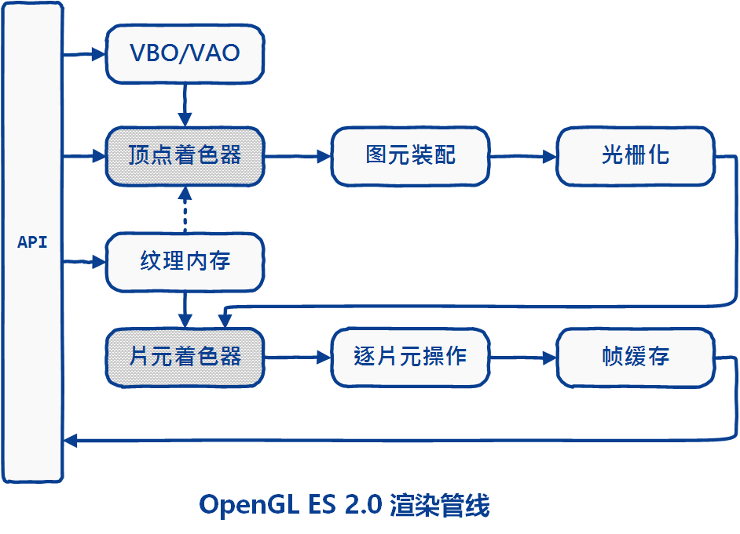
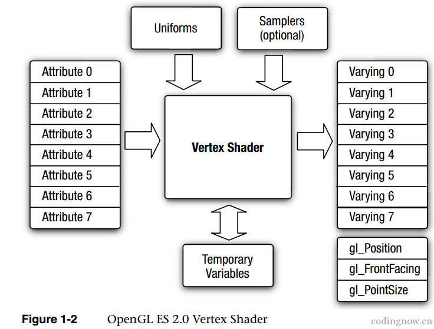
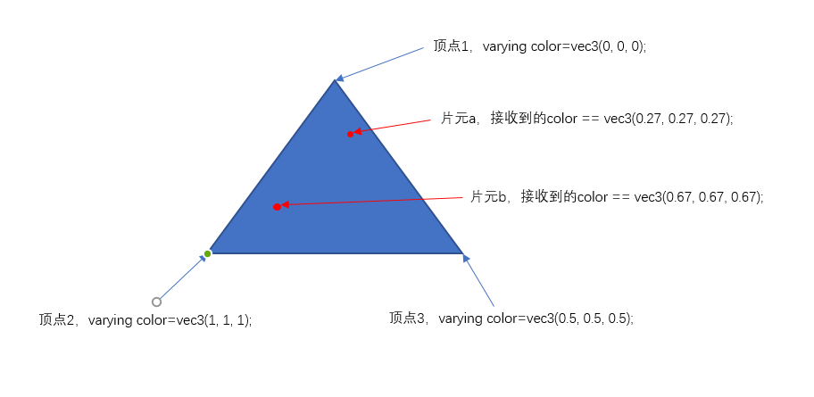
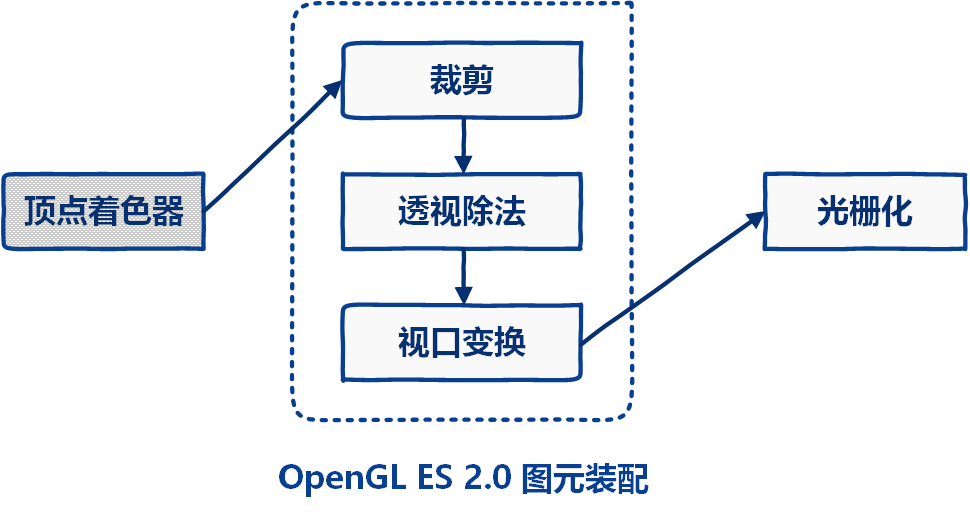
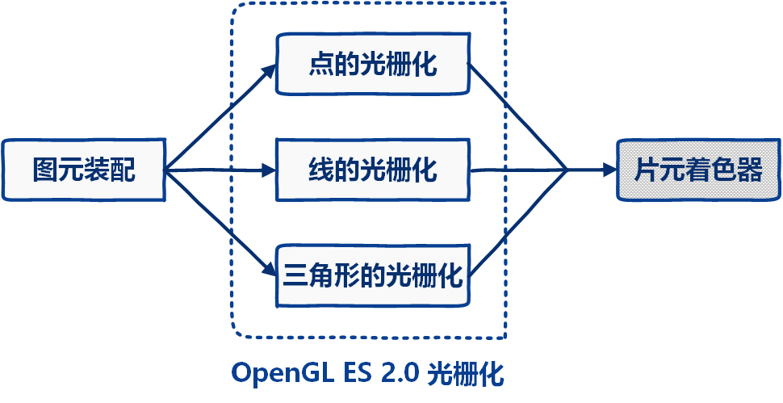
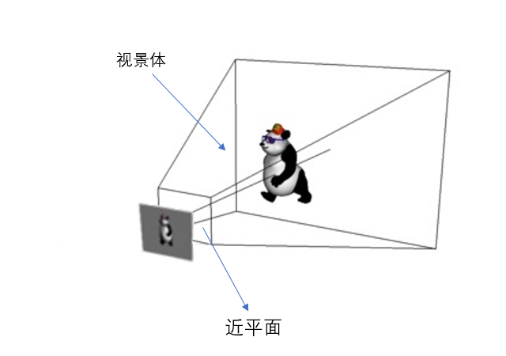
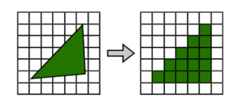
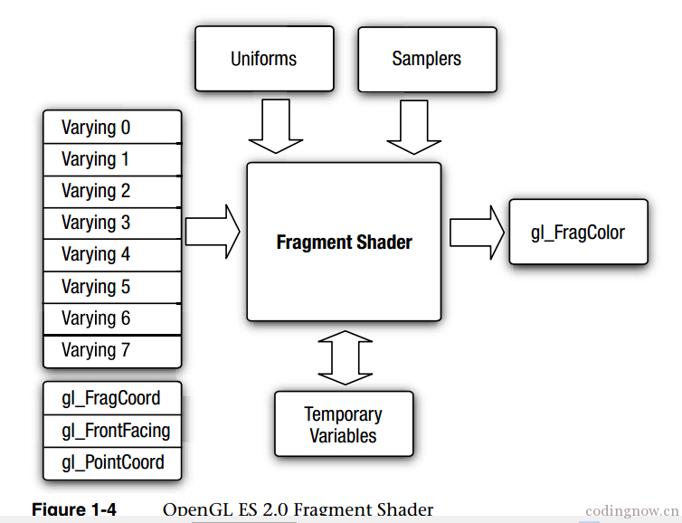

# OpenGL(1) - 渲染管线
### OpenGL ES2.x渲染管线

### VertexShader
顶点着色器，由外部程序传入顶点原始信息至顶点着色器中，一般在里面计算出最终顶点位置、颜色等各项顶点属性信息，然后将其传递给图元装配阶段。每个顶点执行一次。

attribute 0~n：外部程序传入的变量，每个顶点都独有一份。
uniforms：外部程序传入的常量数据，同一个3D物体的所有顶点共有一份。
samplers：这个是可选的，一种特殊的 Uniforms ，表示顶点着色器使用的纹理。
varying 0~n：顶点着色器计算出传递给片元着色器的变量，但是这个变量并不是直接将赋的值送入片元着色器中，而是根据每个顶点对此易变变量的赋值情况和片元与顶点的位置关系，经过插值计算后，再传递给片元。

### 图元装配

经过着色器处理之后的顶点在图元装配阶段被装配为基本图元，图元是一个能用OpenGL ES绘图命令绘制的几何体，绘图命令指定了一组顶点属性，描述了图元的几何形状和图元类型，OpenGL ES 支持三种基本图元：点，线和三角形，它们是可被 OpenGL ES 渲染的。
图元处理最重要的工作为**剪裁**，它将在可视区域外的图元丢弃，可视区域是由摄像机位置和投影位置产生的6个平面的视景体决定的。其中，近平面为投影平面。

### 光栅化

**投影**
由于显示设备都是二维的，所以需要将上一步剪裁得到的3D物体投影到近平面上。

**光栅化**

将由各个顶点形成的几何物体，经过一系列变换后，形成一个个离散化的小单元，这个小单元被称为片元，每个片元对应帧缓冲的一个像素，但是在3D世界中物体是会相互遮挡的，这点在每个片元中也存在，每个通过对比每个片元的深度属性，深度低的会覆盖掉深度高的片元，所以最终在屏幕上显示的像素为最上面片元的像素。

### FragmentShader
片元着色器，若干个顶点经过顶点着色器->图元装配->光栅化后，得到了若干个片元，每个片元执行一次，在里面可以进行纹理的采样，颜色的汇总。计算出最终颜色赋值给内建变量。

varying 0~n：从顶点着色器传递到片元着色器的变量，如上所说，是经过插值化后的变量。
gl_FragColor：内建变量，指该片元的颜色

注：容易看出，片元着色器运行的次数是远远大于顶点着色器的，所以如果某些重复的运算最好在顶点着色器中完成，避免影响执行效率。
