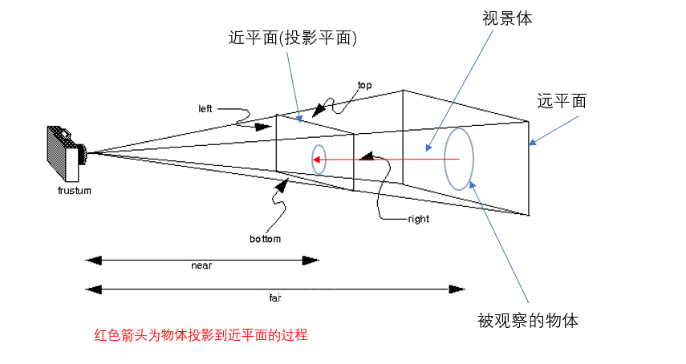
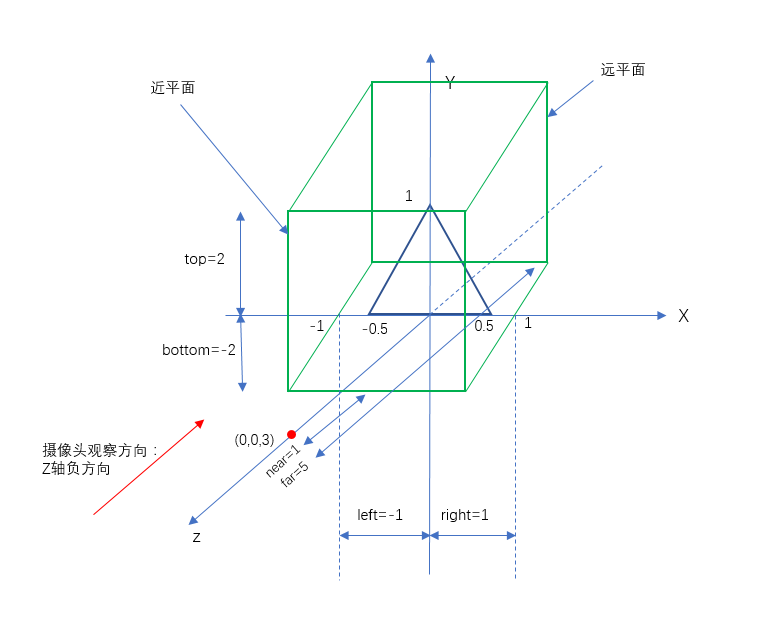
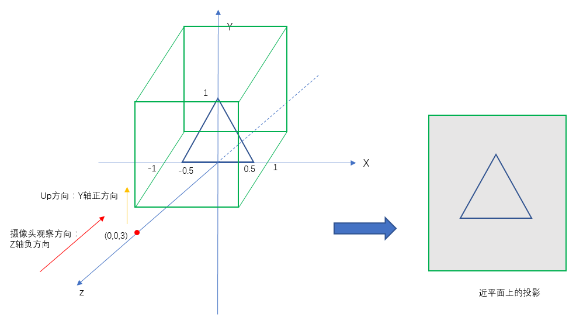
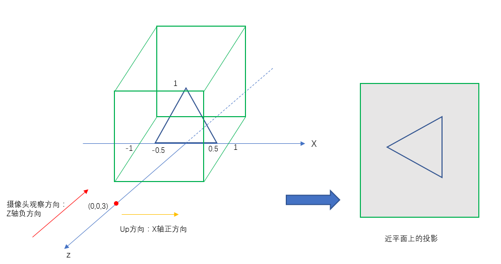

# OpenGL入门(4) - 投影和摄像机
## 1.OpenGL中的摄像机、视景体、近平面
OpenGL的摄像机和现实世界中的人眼很相似，都有一个三维的坐标表示位置，眼睛的朝向和视野范围，位置和眼睛朝向不同，所观察到的物体的形态就会有所不同，视野范围则规定了只有在该范围的物体才会进入人的视线，超出视野范围的部分就无法被观察到(人总不可能观察到耳朵两边和后脑勺的物体吧。)
所以，在OpenGL中的摄像机看来，是这样观察物体的：
 

摄像机视角看近平面：


left、right、bottom、top四条边规定了近平面的大小，near为近平面距离摄像机坐标的距离，far为远平面距离摄像机的距离，这六个变量围成的立方体就是摄像机的可视范围：视景体，物体只有在视景体里面的部分才会被显示出来投影到近平面上。该图为透视投影的案例，投影在近平面的影像会产生近大远小的效果。

## 2.坐标系
#### 手机屏幕坐标系
二维坐标系，左上角为原点，X，Y轴正方向分别为右和下，XY取值范围为屏幕分辨率。


#### OpenGL世界坐标系


三维坐标系，X正方向为右，Y正方向为上，Z正方向朝向我们。
注意：摄像机位置，投影坐标都是基于世界坐标系设置的。

## 3.两种投影方式
### 正交投影


**说明：**视点为摄像机的位置；离视点较近，**垂直于观察方向向量**的平面为近平面，离视点较远，**垂直于观察方向向量**的平面为远平面，
**代码调用**：使用Matrix.orthoM()来设置正交投影。
```java
    /**
     * @param m 生成的投影矩阵,float[4*4]
     * @param mOffset 填充时候起始的偏移量
     * @param left  近平面left边的x坐标
     * @param right 近平面right边的x坐标
     * @param bottom  近平面bottom边的y坐标
     * @param top   近平面top边的y坐标
     * @param near  近平面距离摄像机的距离
     * @param far   远平面距离摄像机的距离
     */
public static void orthoM(float[] m, int mOffset,
        float left, float right, float bottom, float top,
        float near, float far) {
}
```
### 透视投影
**特点：**透视投影的图已经在上面给出了，它的投影线是不平行的，最终相交于视点处，所以会有近大远小的效果。
**代码调用**：使用Matrix.frustumM()来设置透视投影。
```java
/**
* 参数含义同正交投影
*/
public static void frustumM(float[] m, int offset,
            float left, float right, float bottom, float top,
            float near, float far) {
}

public static void perspectiveM(float[] m, int offset,
          float fovy, float aspect, float zNear, float zFar) {
}
```
### left,right,bottom,top,near,far坐标确定





红点为摄像机位置(eyeX,eyeY,eyeZ) = (0, 0, 3)。
蓝色三角形为被观察的物体（为了方便画图没有用立体图形，但是一个道理，立方体的区别就是顶点z坐标非0了），绿色长方体为视景体，此时三角形全部在视景体内。
近平面各坐标：
left=-1,right=1,top=2,bottom=-2，
近平面z坐标 = eyeZ - near=2，
远平面z坐标 = eyeZ - far = -2

**near、far的取值范围规定：**
- 正交投影时，摄像机可位于视景体中间，此时near < 0，far > 0，近平面位于视点后面（Z轴正方向），远平面位于视点前面（Z轴负方向）
- 正交投影时，视景体也可位于视点后面(Z轴正方向)，此时near < 0, far < 0
- 正交投影时，far 和 near没有规定的大小关系，既可以far > near 也可以 far < near，只要物体在视景体内都可以被观察到。
- 透视投影时，摄像机必须位于视景体前面：eyeZ>近平面Z坐标 && eyeZ > 远平面Z坐标，即：eyeZ > (eyeZ - near) && eyeZ >  (eyeZ - far)。

## 4.设置摄像机位置
**代码调用**：使用Matrix.setLookAtM()来设置摄像机位置。
```java
    /**
     *
     * @param rm 生成的摄像机矩阵，float[16]
     * @param rmOffset 填充时候的起始偏移量
     * @param eyeX 摄像机x坐标
     * @param eyeY 摄像机y坐标
     * @param eyeZ 摄像机z坐标
     * @param centerX 观察目标点的x坐标
     * @param centerY 观察目标点的y坐标
     * @param centerZ 观察目标点的z坐标
     * @param upX 摄像机up向量在x上的分量
     * @param upY 摄像机up向量在y上的分量
     * @param upZ 摄像机up向量在z上的分量
     */
    public static void setLookAtM(float[] rm, int rmOffset,
            float eyeX, float eyeY, float eyeZ,
            float centerX, float centerY, float centerZ, float upX, float upY,
            float upZ) {
    }
```
**eyeX,eyeY,eyeZ：**摄像机坐标。
**centerX,centerY,centerZ:**观察点坐标，和摄像机坐标一起决定了摄像机的观察方向，即向量(centerX - eyeX, centerY - eyeY, centerZ - eyeZ)。观察方向方向不同，


**upX,upY,upZ:**摄像机up向量。相对于人眼观察物体中，人头的朝向，头的朝向影响了最后的成像。同样以图来说明：

当up向量为Y的正方向时，正如我们头顶对着天花板，所以观察到的物体是正的，投影在近平面的样子就是正的，如右图。


当up向量为X正方向时，正如我们向右90度歪着脑袋去看这个三角形，看到的三角形就会是向左旋转了90度的三角形。
再比如up向量如果为Z轴正方向，就相当于仰着头去看这个三角形，但是因为我们的up向量和观察方向平行了，所以我们什么也看不到，就比如仰着头去看你眼前的物体时，你什么也看不到。
所以在设置up向量时，一般总是设置为(0,1,0)，这是大多数观察时头朝上的方向。注意：up向量的大小无关紧要，有意义的只有方向。
引用一段网上的解释：
>第一组eyex, eyey,eyez 相机在世界搜索坐标的位置
>第二组centerx,centery,centerz 相机镜头对准的物体在世界坐标的位置
> 第三组upx,upy,upz 相机向上的方向在世界坐标中的方向
> 第一组眼睛就相当于你的头在一个三维坐标中的具体坐标。
> 第二组就是你眼睛要看的物体的坐标。
> 第三组就是你的头的方向。
> 如果你把upx=0;upz=0;upy=1,那么说明你的头是正常人一样的方向，如果upy=-1那么就相当于你是倒立的。
> 如果upx=1;upz=0;upy=0；那么相当于我们看的是右边，如果upx=-1，就相当于看的左边。
> 如果upx=0;upz=1;upy=0；相当于我们看的是屏幕朝我们的方向，如果upz=-1,相当于我们看的是屏幕向里的方向。

## 5.变换流程
一个物体的顶点，是在世界坐标系中被定义的，是怎么样转为为在手机屏幕上显示的坐标的呢，OpenGL中有一系列的变换流程，涉及到了6种不同的空间：
**物体空间：**物体空间坐标系是在物体的几何中心，相对于物体本身而言的。
**世界空间：**世界空间一开始有介绍过，是物体在最终的3D场景中的的位置坐标对应的坐标系空间，通过代码设置的物体顶点坐标，摄像机坐标，投影平面的left,right等坐标，都是相对于世界空间的。
**摄像机空间：**物体经过摄像机观察后，进入摄像机空间，该空间坐标系中，摄像机位于原点，视线沿Z轴负方向，Y轴方向与UP向量一致。
**剪裁空间：**物体即使被摄像机观察到进入了摄像机空间，如果有的部分位于视景体外部，也是看不到的，所以被摄像机观察到的，同时位于视景体外部的部分裁去，留下在视景体内部的物体部分，这部分构成了剪裁空间。
**标准设备空间：**将剪裁空间内的物体进行透视除法后得到的就是在标准设备空间的物体，需要注意的是OpenGL中标准设备空间三个轴的坐标范围都是[-1,1]。
**实际窗口空间：**就是视口，一般使用`GLES20.glViewport(int x, int y, int width, int height)`设置，通常来说是SurfaceView的大小。

- 物体空间->世界空间
乘以物体变换矩阵，比如将三角形先旋转30°再平移(0, 1, 2)，这样按照操作顺序生成的矩阵就是物体的变换矩阵。
```java
public void drawSelf() {
    ...
    //生成变换矩阵
    Matrix.setRotateM(mMMartrix, 0, 0, 0, 1, 0);    
    Matrix.rotateM(mMMartrix, 0, xAngle, 1, 0, 0);
    ...
}
```
- 世界空间->摄像机空间
乘以摄像机矩阵。
- 摄像机空间->剪裁空间
乘以投影矩阵，乘完后，物体就已经被投影在近平面上了，此时物体各个顶点的坐标不再是三维，而是二维，是对应在近平面上的位置。
```java
    /**
     * 传入物体变换矩阵,得到最终最终变换矩阵,送入渲染管线
     * @param spec 物体的变换矩阵
     */
    public static float[] getFinalMatrix(float[] spec) {
        mMVPMatrix = new float[16];
        Matrix.multiplyMM(mMVPMatrix, 0, mCameraMatrix, 0, spec, 0);    //乘以摄像机矩阵
        Matrix.multiplyMM(mMVPMatrix, 0, mProjectionMatrix, 0, mMVPMatrix, 0);//乘以投影矩阵
        return mMVPMatrix;
    }
```
`用户可以操作的为以上三个步骤，一旦物体投影到近平面上后，之后的步骤就由渲染管线自动完成。`
- 剪裁空间->标准设备空间
经过透视除法，将近平面上的物体顶点坐标化为标准设备空间中[-1,1]坐标。
- 标准设备空间->实际窗口空间（视口）
将标准设备空间的XY平面[-1,1]的坐标转换为位于实际窗口中的XY像素坐标。

在视景体内的物体是先投影到近平面，再到标准设备，最终显示到视口的，所以近平面的宽高非常重要，因为一旦近平面的宽高比出现了问题，那么物体就会被拉伸变形。一般会保持近平面的宽高比和视口的宽高比相等。
```java
@Override
public void onSurfaceChanged(GL10 gl, int width, int height) {
    GLES20.glViewport(0, 0, width, height); //设置视口
    float ratio = (float)width / height;
    MatrixState.setProjectFrustum(-ratio, ratio, -1, 1, 2, 10); 
    MatrixState.setCamera(  
            0, 0, 3,
            0f, 0f, 0f,
            0f, -1f, 0f);
}
```
代码中，视口大小为width、height，宽高比为ratio，所以设置近平面的`left = -ratio, right = ratio, bottom = -1, top = 1`，近平面 `width = 2ratio, height = 2, width / height = ratio`，即为视口宽高比。当然，设置近平面位置也需要考虑需要显示的物体的顶点坐标，如果近平面太小，导致视景体太小无法完全包住观察的物体的话，也就无法观察出来了。
