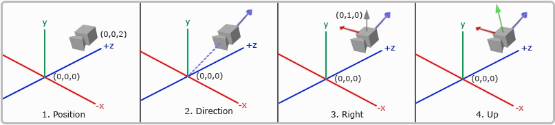
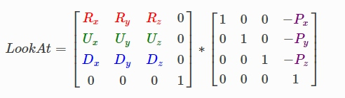
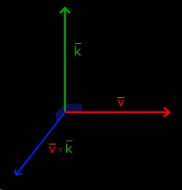
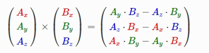
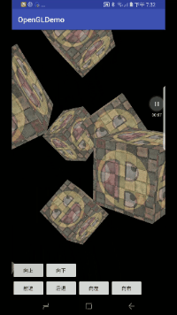

<p class="description"></p>


<br />


# 实现一个能自由移动的摄像机
## 摄像机矩阵（观察矩阵）
对OpenGL有基本概念的同学应该都知道，为了将物体的自己的坐标转换为手机屏幕上的坐标，需要经过几个空间的变换。
- **局部空间（或者被称为物体控件）**
    在该空间下，所有的坐标都是相对于自身而言，坐标系原点可能位于物体中心。
- **世界空间**
    我们在世界空间里指定了一个原点，通过**模型矩阵**，将局部空间中的坐标转换到世界坐标，俗话说就是将我们的物体摆在世界中，这时物体的坐标就是相对于世界坐标系原点的坐标。
- **观察空间**
     使用**观察矩阵**将对象的世界空间的坐标转换为观察者视野前面的坐标。因此观察空间就是从摄像机的角度观察到的空间。这个观察矩阵与摄像机的位置，方向，角度有关。
- **裁剪空间**
    使用**投影矩阵**将顶点坐标从观察空间转换到裁剪空间。裁剪空间定义为：以照相机的角度来看，规定一个可视范围，在可视范围之外的点就不显示，在可视范围内的点，投影矩阵会将其坐标转换为标准化设备坐标系中（-1, 1）。
- **屏幕空间**
    将上一步得到的所有在标准化设备坐标系中的点，映射到手机屏幕的坐标中，比如手机是800 * 1280，在标准化设备坐标系中的点A（0.5,1），就会落在手机屏幕的（400,1280）上。


对于摄像机来说，建立一个观察矩阵，需要几个重要的向量。
**1.摄像机位置**
获取摄像机位置很简单。摄像机位置简单来说就是世界空间中代表摄像机位置的向量。
```java
Vector postion = new Vector(0, 0, 3); // 将摄像机摆在Z轴正方向3的位置
```

**2.摄像机方向**
定义一个front向量，标识摄像机看向的方向，例如(0, 0, -1)就是表示摄像机朝着Z负方向观察，(0, 1, 0)表示朝着Y轴正方向观察，（0, 1, -1）表示在ZY平面朝45度角仰望悲伤。这里我们摄像机在Z轴上，让它朝着Z轴负方向看：
```java
Vector front = new Vector(0, 0, -1);
```
有了pos和front，就可以计算出摄像机看向的点的位置pos + front，就是（0, 0, 2）
```java
Vector target = postion + front = (0, 0, 2);
```
然后就可以计算出摄像机的方向向量direct
```java
Vector direct = position - target = (0, 0, 1);
```
**可以发现，摄像机的方向向量比较奇怪，它不是指向target的向量，而是从target指向摄像机的向量，不要问我为什么因为我也不知道**

**3.右轴（Right）**
我们需要的另一个向量是一个右向量(Right Vector)，它代表摄像机空间的x轴的正方向。为获取右向量我们需要先使用一个小技巧：定义一个上向量(Up Vector)。我们把上向量和第二步得到的摄像机方向向量进行叉乘。两个向量叉乘的结果就是同时垂直于两向量的向量，因此我们会得到指向x轴正方向的那个向量(如果我们交换两个向量的顺序就会得到相反的指向x轴负方向的向量)：
```java
Vector worldUp = new Vector(0, 1, 0);   // 世界坐标系的up向量，永远为Y轴正方向
Vector right = Vector.cross(direct, worldUp);
```
**4.上轴（Up）**
现在已经有了right 和 direct向量，分别对应摄像机坐标系的X正轴和Z轴，获取摄像机的up向量也很简单：通过叉乘实现
```java
Vector up = Vector.cross(direct, right);
```
经过上述一系列操作，就得出了已摄像机为原点的坐标系，有了right direct up 向量就可以创建LookAt矩阵了。



## Look At

>使用矩阵的好处之一是如果你定义了一个坐标空间，里面有3个相互垂直的轴，你可以用这三个轴外加一个平移向量来创建一个矩阵，你可以用这个矩阵乘以任何向量来变换到那个坐标空间。这正是LookAt矩阵所做的，现在我们有了3个相互垂直的轴和一个定义摄像机空间的位置坐标，我们可以创建我们自己的LookAt矩阵了：
 
R是右向量，U是上向量，D是方向向量P是摄像机位置向量。注意，位置向量是相反的，因为我们最终希望把世界平移到与我们自身移动的相反方向。使用这个LookAt矩阵坐标观察矩阵可以很高效地把所有世界坐标变换为观察坐标LookAt矩阵就像它的名字表达的那样：它会创建一个观察矩阵looks at(看着)一个给定目标。

**当然，上面的看不懂就算了，项目开发中不用我们自己去计算LookAt矩阵，Matrix提供了方法可以很方便的获得LookAt矩阵。**

```java
    /**
     *
     * @param rm 生成的摄像机矩阵，float[16]
     * @param rmOffset 填充时候的起始偏移量
     * @param eyeX 摄像机x坐标
     * @param eyeY 摄像机y坐标
     * @param eyeZ 摄像机z坐标
     * @param centerX 观察目标点的x坐标
     * @param centerY 观察目标点的y坐标
     * @param centerZ 观察目标点的z坐标
     * @param upX 摄像机up向量在x上的分量
     * @param upY 摄像机up向量在y上的分量
     * @param upZ 摄像机up向量在z上的分量
     */
    public static void setLookAtM(float[] rm, int rmOffset,
            float eyeX, float eyeY, float eyeZ,
            float centerX, float centerY, float centerZ, float upX, float upY,
            float upZ) {
    }
```
我们已经通过上述操作得到了一系列摄像机向量，就可以传入这个方法得到摄像机矩阵了：
```java
float viewMatrix = new float[16];
Matrix.setIdentityM(viewMatrix, 0);
Matrix.setLookAtM(viewMatrix, 0,
    position.x, position.y, position.z,
    position.x + front.x, position.y + front.y, position.z + front.z,
    up.x, up.y, up.z);
```
## 应用我们的摄像机
**摄像机类**
```java
public class GLCamera {
    // 摄像机的4个关键向量
    private Vector position;
    private Vector front;
    private Vector up;
    private Vector right;
    
    /**
     * 世界坐标系的up，计算right向量用
     * 默认的世界up为(0, 1, 0)
     */
    private Vector worldUp = new Vector(0, 1, 0);        
    
    public GLCamera(Vector position, Vector up, Vector front) {
        this.position = position;
        this.up = up;
        this.front = front;
    }
    public GLCamera(Vector position) {
        this(position, new Vector(0, 1, 0), new Vector(0, 0, -1));
    }
    public float[] getViewMatrix() {
        updateCameraVectors();
        Matrix.setIdentityM(viewMatrix, 0);
        Matrix.setLookAtM(viewMatrix, 0,
            position.x, position.y, position.z,
            position.x + front.x, position.y + front.y, position.z + front.z,
            up.x, up.y, up.z);
        return viewMatrix;
    }
    
    private void updateCameraVectors() {
        front = Vector.normalize(front);
        Vector direct = new Vector(-front.x, -front.y, -front.z);   // 还记得吗，direct的方向和front方向相反
        right = Vector.normalize(Vector.cross(direct, worldUp));
        up = Vector.normalize(Vector.cross(right, direct));
    }       
}
```
**GLSurfaceView类**
```java
public class CameraGLSurfaceView extends GLSurfaceView implements GLSurfaceView.Renderer {

    private final float[] VERTEX_ARRAY = {
            // 位置顶点    // 纹理顶点
            -0.5f, -0.5f, -0.5f,  0.0f, 0.0f,
            0.5f, -0.5f, -0.5f,  1.0f, 0.0f,
            0.5f,  0.5f, -0.5f,  1.0f, 1.0f,
            0.5f,  0.5f, -0.5f,  1.0f, 1.0f,
            -0.5f,  0.5f, -0.5f,  0.0f, 1.0f,
            -0.5f, -0.5f, -0.5f,  0.0f, 0.0f,

            -0.5f, -0.5f,  0.5f,  0.0f, 0.0f,
            0.5f, -0.5f,  0.5f,  1.0f, 0.0f,
            0.5f,  0.5f,  0.5f,  1.0f, 1.0f,
            0.5f,  0.5f,  0.5f,  1.0f, 1.0f,
            -0.5f,  0.5f,  0.5f,  0.0f, 1.0f,
            -0.5f, -0.5f,  0.5f,  0.0f, 0.0f,

            -0.5f,  0.5f,  0.5f,  1.0f, 0.0f,
            -0.5f,  0.5f, -0.5f,  1.0f, 1.0f,
            -0.5f, -0.5f, -0.5f,  0.0f, 1.0f,
            -0.5f, -0.5f, -0.5f,  0.0f, 1.0f,
            -0.5f, -0.5f,  0.5f,  0.0f, 0.0f,
            -0.5f,  0.5f,  0.5f,  1.0f, 0.0f,

            0.5f,  0.5f,  0.5f,  1.0f, 0.0f,
            0.5f,  0.5f, -0.5f,  1.0f, 1.0f,
            0.5f, -0.5f, -0.5f,  0.0f, 1.0f,
            0.5f, -0.5f, -0.5f,  0.0f, 1.0f,
            0.5f, -0.5f,  0.5f,  0.0f, 0.0f,
            0.5f,  0.5f,  0.5f,  1.0f, 0.0f,

            -0.5f, -0.5f, -0.5f,  0.0f, 1.0f,
            0.5f, -0.5f, -0.5f,  1.0f, 1.0f,
            0.5f, -0.5f,  0.5f,  1.0f, 0.0f,
            0.5f, -0.5f,  0.5f,  1.0f, 0.0f,
            -0.5f, -0.5f,  0.5f,  0.0f, 0.0f,
            -0.5f, -0.5f, -0.5f,  0.0f, 1.0f,

            -0.5f,  0.5f, -0.5f,  0.0f, 1.0f,
            0.5f,  0.5f, -0.5f,  1.0f, 1.0f,
            0.5f,  0.5f,  0.5f,  1.0f, 0.0f,
            0.5f,  0.5f,  0.5f,  1.0f, 0.0f,
            -0.5f,  0.5f,  0.5f,  0.0f, 0.0f,
            -0.5f,  0.5f, -0.5f,  0.0f, 1.0f
    };

    private final Vector[] CUBE_POSITIONS = {
            new Vector(0.0f,  0.0f,  0.0f),
            new Vector( 2.0f,  5.0f, -15.0f),
            new Vector(-1.5f, -2.2f, -2.5f),
            new Vector(-3.8f, -2.0f, -12.3f),
            new Vector(2.4f, -0.4f, -3.5f),
            new Vector(-1.7f,  3.0f, -7.5f),
            new Vector(1.3f, -2.0f, -2.5f),
            new Vector(1.5f,  2.0f, -2.5f),
            new Vector(1.5f,  0.2f, -1.5f),
            new Vector(-1.3f,  1.0f, -1.5f)
    } ;

    private FloatBuffer mVertexBuf;

    private final String VERTEX_SHADER =
            "#version 300 es \n" +
                    "layout (location = 0) in vec3 pos; \n" +
                    "layout (location = 1) in vec2 texPos; \n" +
                    "uniform mat4 model; \n" +
                    "uniform mat4 view; \n" +
                    "uniform mat4 projection; \n" +
                    "out vec2 f_texPos; \n" +
                    "void main() { \n" +
                    "   gl_Position = projection * view * model * vec4(pos, 1); \n" +
                    "   f_texPos = texPos; \n" +
                    "}";
    private final String FRAGMENT_SHADER =
            "#version 300 es \n" +
                    "precision mediump float; \n" +
                    "in vec2 f_texPos; \n" +
                    "uniform sampler2D texture1; \n" +
                    "uniform sampler2D texture2; \n" +
                    "out vec4 color; \n" +
                    "void main() { \n" +
                    "   color = mix(texture(texture1, f_texPos), texture(texture2, f_texPos), 0.2); \n" +
                    "}";

    private int mWidth;
    private int mHeight;

    private int mProgram;
    private int mPosHandle;
    private int mTexPosHandle;
    private int mModelMatrixHandle;
    private int mViewMatrixHandle;
    private int mProjectionHandle;

    private int[] mTex = new int[2];
    private int mTexture1Handle;
    private int mTexture2Handle;
    private int VAO;

    private float[] mModelMatrix = new float[16];   // 模型矩阵
//    private float[] mViewMatrix = new float[16];    // 观察矩阵
    private float[] mProjectionMatrix = new float[16];    // 投影矩阵


    public GLCamera mCamera ;

    private Handler mHandler = new Handler() {
        @Override
        public void handleMessage(Message msg) {
            mHandler.sendEmptyMessageDelayed(1, 16);
            requestRender();
        }
    };

    public CameraGLSurfaceView(Context context) {
        super(context);
        init();
    }

    public CameraGLSurfaceView(Context context, AttributeSet attrs) {
        super(context, attrs);
        init();
    }


    private void init() {
        mVertexBuf = array2FloatBuffer(VERTEX_ARRAY);
        setEGLContextClientVersion(3);
        setRenderer(this);
        setRenderMode(RENDERMODE_WHEN_DIRTY);

        mCamera = new GLCamera(new Vector(0, 0, 3)); // 摄像机在0, 0, 3
    }

    private FloatBuffer array2FloatBuffer(float[] array) {
        FloatBuffer floatBuffer = ByteBuffer.allocateDirect(array.length * 4)
                .order(ByteOrder.nativeOrder())
                .asFloatBuffer()
                .put(array);
        floatBuffer.position(0);
        return floatBuffer;
    }

    @Override
    public void onSurfaceCreated(GL10 gl, EGLConfig config) {
        GLES30.glEnable(GLES30.GL_DEPTH_TEST);
        GLES30.glClearColor(0, 0, 0, 1);
        GLES30.glClear(GLES30.GL_COLOR_BUFFER_BIT | GLES30.GL_DEPTH_BUFFER_BIT);

        mProgram = GLUtil.createProgram(VERTEX_SHADER, FRAGMENT_SHADER);
        if (mProgram < 0) {
            throw new IllegalStateException("create program error");
        }
        mPosHandle = GLES30.glGetAttribLocation(mProgram, "pos");
        mTexPosHandle = GLES30.glGetAttribLocation(mProgram, "texPos");
        mModelMatrixHandle = GLES30.glGetUniformLocation(mProgram, "model");
        mViewMatrixHandle = GLES30.glGetUniformLocation(mProgram, "view");
        mProjectionHandle = GLES30.glGetUniformLocation(mProgram, "projection");
        mTexture1Handle = GLES30.glGetUniformLocation(mProgram, "texture1");
        mTexture2Handle = GLES30.glGetUniformLocation(mProgram, "texture2");

        int[] vaos = new int[1];
        GLES30.glGenVertexArrays(1, vaos, 0);
        VAO = vaos[0];
        GLES30.glBindVertexArray(VAO);

        int[] vbos = new int[1];
        GLES30.glGenBuffers(1, vbos, 0);
        GLES30.glBindBuffer(GLES30.GL_ARRAY_BUFFER, vbos[0]);
        GLES30.glBufferData(GLES30.GL_ARRAY_BUFFER, mVertexBuf.capacity() * 4, mVertexBuf, GLES30.GL_STATIC_DRAW);
        GLES30.glVertexAttribPointer(mPosHandle, 3, GLES30.GL_FLOAT, false, 5 * 4, 0);
        GLES30.glVertexAttribPointer(mTexPosHandle, 2, GLES30.GL_FLOAT, false, 5 * 4, 3 * 4);
        GLES30.glEnableVertexAttribArray(mPosHandle);
        GLES30.glEnableVertexAttribArray(mTexPosHandle);
        GLES30.glBindBuffer(GLES30.GL_ARRAY_BUFFER, 0);

        GLES30.glBindVertexArray(0);

        // 建两个纹理id
        GLES30.glGenTextures(2, mTex, 0);

        // 初始化第一个纹理
        GLES30.glBindTexture(GLES30.GL_TEXTURE_2D, mTex[0]);
        GLES30.glTexParameteri(GLES30.GL_TEXTURE_2D, GLES30.GL_TEXTURE_WRAP_S, GLES30.GL_MIRRORED_REPEAT);
        GLES30.glTexParameteri(GLES30.GL_TEXTURE_2D, GLES30.GL_TEXTURE_WRAP_T, GLES30.GL_MIRRORED_REPEAT);
        GLES30.glTexParameteri(GLES30.GL_TEXTURE_2D, GLES30.GL_TEXTURE_MIN_FILTER, GLES30.GL_NEAREST);
        GLES30.glTexParameteri(GLES30.GL_TEXTURE_2D, GLES30.GL_TEXTURE_MAG_FILTER, GLES30.GL_LINEAR);
        GLUtils.texImage2D(GLES30.GL_TEXTURE_2D, 0, BitmapFactory.decodeResource(getResources(), R.drawable.wall), 0);

        // 初始化第二个纹理
        GLES30.glBindTexture(GLES30.GL_TEXTURE_2D, mTex[1]);
        GLES30.glTexParameteri(GLES30.GL_TEXTURE_2D, GLES30.GL_TEXTURE_WRAP_S, GLES30.GL_MIRRORED_REPEAT);
        GLES30.glTexParameteri(GLES30.GL_TEXTURE_2D, GLES30.GL_TEXTURE_WRAP_T, GLES30.GL_MIRRORED_REPEAT);
        GLES30.glTexParameteri(GLES30.GL_TEXTURE_2D, GLES30.GL_TEXTURE_MIN_FILTER, GLES30.GL_NEAREST);
        GLES30.glTexParameteri(GLES30.GL_TEXTURE_2D, GLES30.GL_TEXTURE_MAG_FILTER, GLES30.GL_LINEAR);
        GLUtils.texImage2D(GLES30.GL_TEXTURE_2D, 0, BitmapFactory.decodeResource(getResources(), R.drawable.awesomeface), 0);

        GLES30.glBindTexture(GLES30.GL_TEXTURE_2D, 0);

    }

    @Override
    public void onSurfaceChanged(GL10 gl, int width, int height) {
        mWidth = width;
        mHeight = height;
        GLES30.glViewport(0, 0, width, height);

        mHandler.removeCallbacksAndMessages(null);
        mHandler.sendEmptyMessageDelayed(1, 16);
    }

    @Override
    public void onDrawFrame(GL10 gl) {

        GLES30.glClearColor(0, 0, 0, 1);
        GLES30.glClear(GLES30.GL_COLOR_BUFFER_BIT | GLES30.GL_DEPTH_BUFFER_BIT);

        GLES30.glUseProgram(mProgram);

        // 第一个纹理id 对应纹理单元0
        GLES30.glActiveTexture(GLES30.GL_TEXTURE0);
        GLES30.glBindTexture(GLES30.GL_TEXTURE_2D, mTex[0]);
        GLES30.glUniform1i(mTexture1Handle, 0);

        // 第二个纹理id 对应纹理单元1
        GLES30.glActiveTexture(GLES30.GL_TEXTURE1);
        GLES30.glBindTexture(GLES30.GL_TEXTURE_2D, mTex[1]);
        GLES30.glUniform1i(mTexture2Handle, 1);


        // 设置观察矩阵(摄像机矩阵)
        GLES30.glUniformMatrix4fv(mViewMatrixHandle, 1, false, mCamera.getViewMatrix(), 0);

        // 设置投影矩阵
        Matrix.setIdentityM(mProjectionMatrix, 0);
        Matrix.perspectiveM(mProjectionMatrix, 0, 45, (float)mWidth / mHeight, 0.1f, 100f);
        GLES30.glUniformMatrix4fv(mProjectionHandle, 1, false, mProjectionMatrix, 0);

        // VAO
        GLES30.glBindVertexArray(VAO);
        // 这里重复调用10次draw画10个正方体，每个正方体的模型矩阵都不同，所以需要每次都计算
        for (int i = 0;i < CUBE_POSITIONS.length;i++) {
            // 设置模型矩阵
            Matrix.setIdentityM(mModelMatrix, 0);
            Matrix.translateM(mModelMatrix, 0, CUBE_POSITIONS[i].x, CUBE_POSITIONS[i].y, CUBE_POSITIONS[i].z);
            Matrix.rotateM(mModelMatrix, 0, i * 20f, 1f, 0.3f, 0.5f);
            GLES30.glUniformMatrix4fv(mModelMatrixHandle, 1, false, mModelMatrix, 0);

            GLES30.glDrawArrays(GLES30.GL_TRIANGLES, 0, 36);
        }
        GLES30.glBindVertexArray(0);

    }
}
```
**Vector类**
Android中貌似没有一个表示向量的类，于是自己搞了一个
```java
public class Vector {
    public float x;
    public float y;
    public float z;

    public Vector(float x, float y, float z) {
        this.x = x;
        this.y = y;
        this.z = z;
    }

    public Vector(Vector vector) {
        this.x = vector.x;
        this.y = vector.y;
        this.z = vector.z;
    }

    /**
     * 俩向量的叉乘
     */
    public static Vector cross(Vector a, Vector b) {
        float x = a.y * b.z - a.z * b.y;
        float y = a.z * b.x - a.x * b.z;
        float z = a.x * b.y - a.y * b.x;

        return new Vector(x, y, z);
    }
    /**
     * 标准化向量
     */
    public static Vector normalize(Vector v) {
        double length = Math.sqrt(v.x * v.x + v.y * v.y + v.z * v.z);   // 向量的模
        return new Vector(v.x / (float)length, v.y / (float)length, v.z / (float)length);
    }

```
**叉乘**
>叉乘只在3D空间中有定义，它需要两个不平行向量作为输入，生成一个正交于两个输入向量的第三个向量。如果输入的两个向量也是正交的，那么叉乘之后将会产生3个互相正交的向量。接下来的教程中这会非常有用。下面的图片展示了3D空间中叉乘的样子：







## 让摄像机动起来
### 让摄像机平移
想象一下你们在玩第一人称游戏时，是怎么移动人物的，是通过**WASD**是吗，分别对应：
W - 向前移动
S - 向后移动
A - 向左移动
D - 向右移动
但是其实如果人物可以有上天遁地的功能的话，其实还会有**向上移动**和**向下移动**，人物做不到，但是摄像机可以做到

**我们先定义一组方向枚举，表示 前进、后退、上、下、左、右**
```java
public enum Direction {
    FORWARD, BACKWARD, LEFT, RIGHT, UP, DOWN
}
```

**然后定义一个方法，处理来自外部的移动**
```java
public void processKeyboardMovement(Direction direction, float offset) {
    if (direction == Direction.FORWARD) {
        position.x += front.x * offset;
        position.y += front.y * offset;
        position.z += front.z * offset;
    } else if(direction == Direction.BACKWARD) {
        position.x -= front.x * offset;
        position.y -= front.y * offset;
        position.z -= front.z * offset;
    } else if(direction == Direction.LEFT) {
        Vector crossVector = Vector.normalize(Vector.cross(front, up));
        position.x -= crossVector.x * offset;
        position.y -= crossVector.y * offset;
        position.z -= crossVector.z * offset;
    } else if(direction == Direction.RIGHT) {
        Vector crossVector = Vector.normalize(Vector.cross(front, up));
        position.x += crossVector.x * offset;
        position.y += crossVector.y * offset;
        position.z += crossVector.z * offset;
    } else if (direction == Direction.UP) {
        position.x += up.x * offset;
        position.y += up.y * offset;
        position.z += up.z * offset;
    } else if (direction == Direction.DOWN) {
        position.x -= up.x * offset;
        position.y -= up.y * offset;
        position.z -= up.z * offset;
    }
}
```
该方法接受两个参数，一个是方向，一个是距离，前后移动是以front方向为移动方向移动，左右是以front和up的叉乘向量，也就是right向量，上下则是up向量。
然后让距离乘以移动向量的各个分量，加到对应position向量上去就好了。

**Important：为什么是移动方向向量直接乘offset，会不会导致距离不对？**
还记的`updateCameraVectors`方法，我们对于front up right向量都执行了标准化向量（**normalize**）操作，标准向量就是长度为1的向量，用标准化向量的各个分量乘以移动距离，得到的自然就是在各个分量上需要移动的距离。

**最后，在Activity加上6个按钮，表示往6个方向移动。**
```java
    public void goForward(View view) {
        mGLSurfaceView.mCamera.processKeyboardMovement(GLCamera.Direction.FORWARD, 0.5f);
    }
    public void backUp(View view) {
        mGLSurfaceView.mCamera.processKeyboardMovement(GLCamera.Direction.BACKWARD, 0.5f);
    }
    public void goLeft(View view) {
        mGLSurfaceView.mCamera.processKeyboardMovement(GLCamera.Direction.LEFT, 0.5f);
    }
    public void goRight(View view) {
        mGLSurfaceView.mCamera.processKeyboardMovement(GLCamera.Direction.RIGHT, 0.5f);
    }
    public void up (View view) {
        mGLSurfaceView.mCamera.processKeyboardMovement(GLCamera.Direction.UP, 0.5f);
    }
    public void down (View view) {
        mGLSurfaceView.mCamera.processKeyboardMovement(GLCamera.Direction.DOWN, 0.5f);
    }
```

### 让摄像机移动视角（变换front方向）
（写不动了，下次写吧.....）

## 效果




