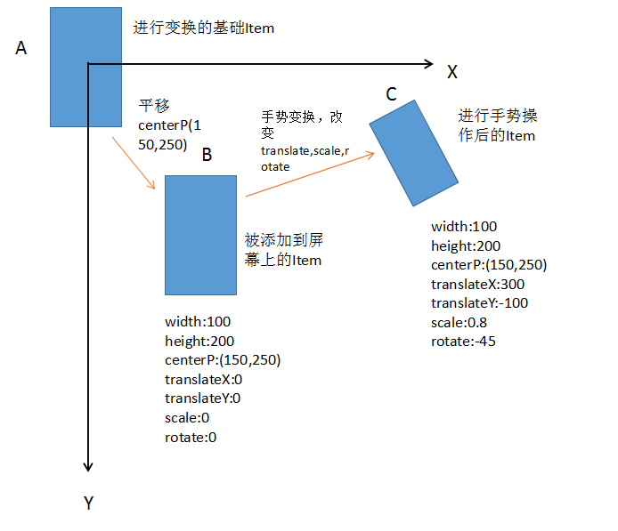

<p class="description"></p>


<br />

## 需求
-  添加文字，文字可以拖动缩放旋转
-  添加多个表情，表情可以拖动缩放旋转
-  添加涂鸦，用手指在屏幕上画出形状，支持撤销和换色

## 最终效果


## 整体设计和代码实现
如何实现需求，这里了采取一个View承载多个Layer的方法：

-  Layer：逻辑上的“层”，一个层独立负责一个涂鸦类型，比如需求说的：文字层，表情层和涂鸦层。Layer最重要的三个方法：

```java
//当一个ACTION_DOWN发生时，判断自己需不需要这次的TouchEvent
boolean accept(MotionEvent event); 

//处理MotionEvent
boolean dealTouch(MotionEvent event)

//将自己画出来
void draw(Canvas canvas)
```


-  View：内部维护了一个`List<Layer>`，并完成以下两种工作：
    1. 负责接收发生的TouchEvent并完成向Layer的分发TouchEvent
    2. 向Layer提供Canvas，让他们画出来

List中的Layer是有优先级的，排在越靠后的Layer具有越高的优先级，优先级越高，摆在View中的位置也就比其他Layer"高"，换句话或就是z大。最高优先级的Layer会最先收到TouchEvent，并在绘制的时候绘制在最上面。

事件流程：
-  当用户手指触摸到屏幕上时，首先发生ACTION_DOWN，DoodleView会从后往前遍历`List<Layer>`，调用Layer的accept去问这个Layer需不需要处理这一次的MotionEvent，如果在遍历的过程中有一个Layer的accept的方法返回了true，代表它要消费这次事件，那么DoodleView会记下这个Layer并立即结束遍历。并将这一次的所有TouchEvent事件都交给这个Layer的dealTouch()处理。
-  每一次DoodleView的onTouchEvent调用，都会调用一次invalidate()重绘界面，在它的onDraw方法中，会从前往后的遍历`List<Layer>`，取出Layer调用它的draw()方法画出来，这就保证了排在List中最后的Layer会画在其他Layer上面。


代码实现

```java
public interface Layer {
    /**
     * 画图，画在外部传进的Canvas上
     */
    void draw(Canvas canvas);

    /**
     * 处理TouchEvent事件
     */
    boolean dealTouch(MotionEvent event);

    /**
     * 判断需不需要TouchEvent事件
     */
    boolean accept(MotionEvent event);

    ...
}
```
```java
// DoodleView
@Override
public boolean onTouchEvent(MotionEvent event) {
    /**
        * 每一次的down事件，都去从上往下寻找需要处理的Layer，如果找到，今后的Event事件都给它处理
        * 如果没有找到，则交给EmptyLayer处理
        */
    if (mActiveLayer == mEmptyLayer) {
        if (event.getAction() == MotionEvent.ACTION_DOWN) {
            mActiveLayer = findActiveLayer(event);
            mActiveLayer.requestActive(true);
            SLog.d(TAG,mActiveLayer.toString() + " hold the TouchEvent.");
        }
    }
    return mActiveLayer.dealTouch(event);
}

//从最上面的Layer往下，判断哪个层需要这次的事件
public BaseLayer findActiveLayer(MotionEvent event) {
    int i;
    for (i = mLayerList.size() - 1; i >= 0; i--) {
        BaseLayer layer = mLayerList.get(i);
        if (layer.accept(event)) {
            return layer;
        }
    }
    //没有层需要此次事件
    return mEmptyLayer;
}

```
```java
// DoodleView#onDraw：
@Override
protected void onDraw(Canvas canvas) {
    if (!isEnable) {
        return;
    }
    for(Map.Entry<String,BaseLayer> layerEntry : mLayerMap.entrySet()) {
        BaseLayer layer = layerEntry.getValue();
        layer.draw(canvas);
    }
}


```


## 手势处理
整理好了总体的框架，现在要去实现里面的细节：如何处理TouchEvent实现各种旋转缩放平移的手势，这里用到了一个类：Matrix，关于Matrix的详解：http://blog.csdn.net/cquwentao/article/details/51445269

在涂鸦功能中，每一个可以被手势拖动缩放的东西：一个表情，一行文字，都看做一个DoodleItem，一个DoodleItem有以下四个基本属性。
-   宽(width)、高(height)、初始的中心点坐标(centerPoint)，通过这些值可以确定一个DoodleItem在屏幕上的初始位置和大小。
-   相对于初始中心点，变换后的中心点在XY轴的平移量(translateX，translateY)，初始为0。
-   缩放值(scale)，初始为1
-   旋转角度(rotate)，初始为0。

**每一个DoodleItem在屏幕上的形状，位置，都认为是由中心点在屏幕原点的DoodleItem(叫它基础Item)经过变换得到的（这一点是理解矩阵变换的基础），即使是一开始添加到屏幕上的DoodleItem，也是由在屏幕原点的DoodleItem平移centerPoint得到的。**




上图是一个DoodleItem进行变换的三个状态。在绘制过程中，通过Matrix，顺序的进行对Matrix进行以下变换(一般来说，平移是在最后进行的，因为scale和rotate操作都是相对于原点的，而一开始的原点就是Item的中心点，刚好就能实现相对于中心点的旋转缩放。如果先平移，中心点就不再是原点了，这样缩放和旋转还相对于原点就会出问题)：

1. scale,rotate变换
2. 平移到初始centerP位置
3. 平移translateX,translateY

我们就可以认为，A上任何一个点，经过该Matrix变换后，得到的是C上对应的点，A上所有点经过Matrix变换后就得到了C。如果将这个Matrix作用在Canvas上，就可以把画布的坐标系调整为以下效果：


直接对Canvas进行矩阵变换的好处就是，画布已经进行了scale值的缩放，直接画原来的width和height就可以了，不用对原本的width和height自己进行scale和rotate。如果是画图片，直接调用drawable.draw(Canvas)便可将图片画出来。

一个Layer，其实就是管理着里面很多DoodleItem一个容器，在Layer的dealTouch方法中，主要改变的是，被操作DoodleItem的translateX，translateY，scale，rotate。绘制流程主要是画出每一个DoodleItem，而画每一个DoodleItem的过程，其实就是利用这个DoodleItem的translateX，translateY，scale，rotate这些值，生成一个变换矩阵，将这个矩阵作用到Canvas上，就可以将Canvas的坐标系原点转换到每一个DoodleItem的中心点上，然后进行绘制。 

那么，是怎样改变DoodleItem的四个值的，我独立出一个类(GestureHelper)用来处理DoodleItem的TouchEvent事件：

```java
// GestureHelper
/**
* 将Touch事件交给Manager处理
* @param needScale  是否支持单指缩放旋转
*/
public void dealTouchEvent(MotionEvent event, boolean needScale) {
    if(mItem == null) {
        return;
    }
    switch (event.getAction() & MotionEvent.ACTION_MASK) {
        case MotionEvent.ACTION_DOWN:
            dealDown(event, needScale);
            break;
        case MotionEvent.ACTION_POINTER_DOWN:
            dealPointerDown(event);
            break;
        case MotionEvent.ACTION_MOVE:
            dealMove(event, needScale);
            break;
        case MotionEvent.ACTION_POINTER_UP:
            dealPointerUp(event);
            break;
        case MotionEvent.ACTION_UP:
            dealUp(event);
            break;
    }
}
```

### translateX,translateY
平移在单指和双指都可以操作，所以应该分开情况去计算平移量

#### 单指情况下
**ACTION_DOWN**：主要是记录初始值。比如手指按下的startX,startY
```java
private void dealDown(MotionEvent event, boolean needScale) {
    mActionDown = true;
    mState = STATE_DRAG;

    float x = event.getX(0);
    float y = event.getY(0);

    mStartX = x;
    mStartY = y;

    mOldTranslateXValue = mItem.translateXValue;
    mOldTranslateYValue = mItem.translateYValue;
}

```

**ACTION_MOVE**：根据startX,startY计算偏移量，重新赋给translateX,translateY
```java
private void dealMove(MotionEvent event, boolean needScale) {
    if(!mActionDown) {
        //如果move调用之前没有调用过down事件，说明这是一个从move传进来的事件，需要把第一个move事件当做down事件来设置初始值
        mActionDown = true;
        dealDown(event, needScale);
        return;
    }
    if (event.getPointerCount() == 1 && mState == STATE_DRAG) {
        //单指拖拽
        if(mActionPointerUp) {
            //是ACTION_POINTER_UP后的第一次move事件，设置初始值作为之后Move的参考
            mActionPointerUp = false;
            mStartX = event.getX(0);
            mStartY = event.getY(0);
            mOldTranslateXValue = mItem.translateXValue;
            mOldTranslateYValue = mItem.translateYValue;
            return;
        }

        float dX = event.getX(0) - mStartX;
        float dY = event.getY(0) - mStartY;

        mItem.translateXValue = mOldTranslateXValue + dX;
        mItem.translateYValue = mOldTranslateYValue + dY;
    } 
    ...
}
```


#### 双指情况下
不再使用ACTION_DOWN中手指的startX,startY作为初始点，而是使用两根手指的中点作为初始点

**ACTION_POINTER_DOWN**
```java
private void dealPointerDown(MotionEvent event) {
    float x = event.getX(1);
    float y = event.getY(1);
    mItem.isDualFinger = true;
    if (mState == STATE_DRAG || mState == STATE_DRAG_ONE_POINT) {
        mState = STATE_CONTROL;
        mOldScaleValue = mItem.scaleValue;
        mOldRotateValue = mItem.rotateValue;

        //从单指拖动变成双指拖动，OldTranslateValue重新记录
        mOldTranslateXValue = mItem.translateXValue;
        mOldTranslateYValue = mItem.translateYValue;

        mStartDistance = GestureUtil.spacing(event);
        mStartDegree = GestureUtil.computeDegreeBySin(event);
        float[] f = GestureUtil.computeCenterPoint(event);
        mStartCenterX = f[0];
        mStartCenterY = f[1];
    }
}
```
**ACTION_MOVE**
```java
private void dealMove(MotionEvent event, boolean needScale) {
    if(!mActionDown) {
        //如果move调用之前没有调用过down事件，说明这是一个从move传进来的事件，需要把第一个move事件当做down事件来设置初始值
        mActionDown = true;
        dealDown(event, needScale);
        return;
    }
    mItem.isKeep = true;
    if (event.getPointerCount() == 1 && mState == STATE_DRAG) {
        ...
    } else if (event.getPointerCount() == 2 && mState == STATE_CONTROL) {
        //双指控制
        float currDistance = GestureUtil.spacing(event);
        float currDegree = GestureUtil.computeDegreeBySin(event);
        float[] f = GestureUtil.computeCenterPoint(event);
        float currCenterX = f[0];
        float currCenterY = f[1];

        mItem.scaleValue = mOldScaleValue * (currDistance / mStartDistance);
        mItem.rotateValue = (mOldRotateValue + (currDegree - mStartDegree)) % 360;
        mItem.translateXValue = mOldTranslateXValue + (currCenterX - mStartCenterX);
        mItem.translateYValue = mOldTranslateYValue + (currCenterY - mStartCenterY);

    } 
}

```

### scale
缩放只能双指缩放，所以只需要在ACTION_POINTER_DOWN记录初始值

**ACTION_POINTER_DOWN**
保存两根手指的距离
```java
private void dealPointerDown(MotionEvent event) {
    float x = event.getX(1);
    float y = event.getY(1);
    mItem.isDualFinger = true;
    if (mState == STATE_DRAG || mState == STATE_DRAG_ONE_POINT) {
        mState = STATE_CONTROL;
        ...
        mOldScaleValue = mItem.scaleValue;// 保存按下时的缩放值

        ...
        mStartDistance = GestureUtil.spacing(event); // 保存两根手指的距离
        ...
    }
}
```

**ACTION_MOVE**
通过两根手指距离的变化算出scale
```java
float currDistance = GestureUtil.spaceing(event);
mItem.scaleValue = mOldScaleValue * (currDistance / mStartDistance);
```


### rotate
和scale处理逻辑类似，在ACTION_POINTER_DOWN记录两根手指的初始角度，在ACTION_MOVE中做增量处理赋给rotateValue就好了。

### 将DoodleItem的各种值作用于Matrix
得到一个DoodleItem对应的Matrix：
```java
/**
* 根据DoodleItem的各种变量返回一个对应的矩阵
*/
public Matrix getMatrix(ZoomItem item){
    mMatrix.reset();
    if (item == null) {
        return mMatrix;
    }

    mMatrix.postRotate(item.rotateValue);
    mMatrix.postScale(getItemScale(item), getItemScale(item));
    if(item.centerP != null) {
        mMatrix.postTranslate(item.centerP.x, item.centerP.y);
    }
    mMatrix.postTranslate(item.translateXValue, item.translateYValue);

    return mMatrix;
}
```

所以在Layer的draw方法中，就是获取出这个Matrix对Canvas进行操作，拿FaceLayer(表情层)举例：
```java
/**
* 画表情
* Rect的表示是通过两个点表示的，所以经过Matrix变换后的Rect已经变形，所以不能直接调用Canvas.drawRect画
* 这里采取的方法是将画布同样根据矩阵变换，变换后的坐标系就是一个Item自己的坐标系，原点是该Item的中点
* 通过这种方法就可以直接画出图案
*/
private void drawItem(FaceItem item,Canvas canvas) {
    if(item == null) {
        return;
    }

    canvas.save();
    canvas.concat(mGestureHelper.getMatrix(item));
    item.draw(canvas, true);
    canvas.restore();
}
```

在FaceItem的draw方法中：
```java
/**
* @param isDraw 判断该方法调用是在draw还是save
*/
public void draw(Canvas canvas, boolean isDraw) {
    //计算可操作区域
    float width = this.width;
    float height = this.height;

    if(width * scaleValue < GestureHelper.MIN_HOT_SIZE) {
        width = GestureHelper.MIN_HOT_SIZE / scaleValue;
    }
    if(height * scaleValue < GestureHelper.MIN_HOT_SIZE) {
        height = GestureHelper.MIN_HOT_SIZE / scaleValue;
    }

    canvas.save();
    // 经过Matrix变换的Canvas的圆点在Item的重点，如果直接调用drawable的draw方法，会从中点开始画
    // 图片见画在了右下角的位置，所以要做一个平移操作，将圆点移回DoodleItem左上角
    canvas.translate(-this.width / 2, -this.height / 2);
    drawable.draw(canvas);
    canvas.restore();
}

```

### 逆矩阵的作用

DoodleItem经过变换后的Matrix，可以把相对于屏幕坐标系的点，变换到DoodleItem自身的坐标系中。这个矩阵的逆矩阵的作用则是反过来，将在DoodleItem自己坐标系中的点，变换到屏幕坐标系中。

如果需要判断用户的手指落下时的点，是否在DoodleItem的范围内，其实就是将手指按下的点，看成是在DoodleItem自身的坐标系中，是否在Item对应的width和height之内，经过平移缩放后的Item，已经不再是一个摆正的长方形，很难直接在Item自身的坐标系中判断这个点是否在Item中间，于是就需要逆矩阵将手指按下的点，重新变换到屏幕坐标系上，通过将变换后的点的坐标和基础Item的width和height比较，就很容易知道是否这个点是否落在Item中间。


在Layer的accept方法中，其实就是遍历它管理的Item，看看是否ACTION_DOWN落在了某个Item中间，如果是的话，就返回true，之后的MotionEvent就用来变换这个Item了。

## 优化

### 涂鸦图片大小的优化
所有Layer的内容，都需要保存为一张涂鸦图片，我的做法是创建一张屏幕大小的Bitmap，使用Canvas去操作它，将这个Canvas传给所有Layer的draw(Canvas)，重新走一遍draw的逻辑，让Bitmap中有Layer的内容。

**优化原因**：在一些分辨率高，屏幕大的手机中，生成的Bitmap会占用十几M内存，且重新走draw方法的时候耗时很长，有明显的卡顿，生成的图片文件也有十几M的大小，造成了时间和空间上的损耗。

**优化方法**：其实作为呈现在视频上面的涂鸦图片来说，它对分辨率的要求不会太高，用户添加个表情，画几条线，不会要求观看的时候跟画出来一样清晰，所以在日迹中的策略是，生成的Bitmap为640*480，这样既保证了比较清晰的图片，也节省了空间和时间。

那么自然的就有个问题，比如用户的所有操作都是在1024*768的手机上，每一个DoodleItem的坐标值也是相对于1024*768保存的，而一张Bitmap只有640*480，在draw的时候不是很容易画出界吗？


在这种情况下，可以根据屏幕的宽/高和生成的Bitmap的宽/高相除，算出缩放比scale(因为要等比缩放，所以只能采用宽和高中的一种比例，这取决于具体的业务需要宽对齐还是高对齐)，在重新走draw逻辑的时候之前先对Canvas进行一次缩放操作，这样画出来的DoodleItem都是根据Bitmap的宽高呈现的了。对此我给每一个Layer加了一个save()，来进行这种操作。
```java
@Override
public void save(Canvas canvas, float scaleValue, boolean needDynamic) {
    canvas.save();
    canvas.scale(scaleValue,scaleValue);

    for(FaceItem item : mFaceItems) {
        canvas.save();
        canvas.concat(mGestureHelper.getMatrix(item));
        item.draw(canvas, false);
        canvas.restore();
    }
    canvas.restore();
}
```


### 给DoodleItem设置最小操作热区
**优化原因**：在用户操作DoodleItem的过程中，如果将其缩放的很小很小，就会导致下一次的ACTION_DOWN判断区域过小，体现在用户很难点中想要操作的表情/文字。
**优化方法**：在GestureHelper中，定下一个最小操作热区，在判断是否点中DoodleItem的方法中，进行width和height大小判断，如果大小乘上scale值比操作热区大小还小时，直接采用操作热区的大小作为Item判断时的区域大小。
