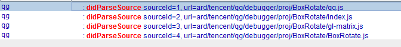

## 1.理解JSCore的Debugger整体架构
### 1.1 JSC的Debugger层
先来看一下JSCore对外提供的Debugger框架：


#### 1.1.1 JSC::Debugger (JSC的调试接口)
JSCore对外暴露的调试接口，主要用于开发者连接/断开（attach&detach）Debugger、设置断点、通过`continue` `step` 对断住的程序进行控制，以及当断点触发后，子类收到的回调方法。

**连接**：通过调用`attach(JSGlobalObject*)`连接到Debugger，让程序具有调试能力。同样也有对应的`detach(JSGlobalObject*, ReasonForDetach)`方法断开连接。
**断点**：调用`BreakpointID setBreakpoint(Breakpoint&)`方法给Debugger设置断点，`JSC::Breakpoint`有文件的`sourceID`、行号等信息。


**各种调试方法**：`continue`、`stepXXX`，都是当断点停下后的调试方法。
**留给子类实现**：
`sourceParsed(SourceProvider)`：当调试程序attach上Debugger后，会传入一个`JSGlobalObject`，`VM`会从其中读取到运行的JS文件,进行一个sourceID和文件的匹配，将这些每个文件匹配的结果保存在这个`SourceProvider`中并分发给子类使用。




`handlePause(JSGlobalObject*, ReasonForPause)`：程序pause会触发的回调，`ReasonForPause`说明了pause的原因。
`handleBreakPointHit(JSGlobalObject*,Breakpoint&)`:命中断点的回调。如果是命中断点导致程序pause，则上下两个方法都会调用。

#### 1.1.2 Inspector:ScriptDebugServer （JSC对Debugger的包装）
如果不直接继承`Debugger`，JSCore也提供了`ScriptDebugServer`这个封装类，该类继承自`Debugger`，实现了Debugger留给子类的方法，进行了一些处理。并采取注册Listener的形式将这些方法重新dispatch出去，留给开发者实现的`ScriptDebugListener`接口更加方便好用。

**dispatch方法**
`dispatchDidParseSource(ListenerSet& listeners, JSC::SourceProvider*)`：`sourceParsed`对应的dispatch方法，该方法会将`SourceProvider`的JS文件信息都取出来，封装成`ScriptDebugListener::Script`，最终调用`ScriptDebugListener.didParseSource(JSC::SourceID, Script&)`给Listener。
其余的dispatch方法大都类似，都是回调到Listener的相关接口。


### 1.2 QG的Debug层


#### 1.2.1 JSDebuggerImpl （QG Debugger的实现类）
-   同时继承自`ScriptDebugServer`和`ScriptDebugListener`，除了重写方法外，对外暴露`Attach`&`Detach`接口，将自己`addListener`到Server中。
-   JSDebuggerImpl中有一个JSGlobalObject，Debugger的sourceParsed就是用这个取sourceProvider。
-   将`OnBreakpointHit`和`OnException`事件通过`JSDebuggerImplHandler`通知出去，而`JSDebuggerImplHandler`的实现类就是`JsDebuggerWrapper`

#### 1.2.2 JsDebuggerWrapper （包装、事件分发）
-   包装了`JSDebuggerImpl`
-   实现`JSDebuggerImplHandler`接口，并将接口的回调再次通过`JsDebuggerWrapperCallback`往外分发。`JsDebuggerWrapperCallback`则是由`debugserver`创建出来的。

#### 1.2.3 debugserver （通讯）
-   包装了`JsDebuggerWrapper`
-   创建`JsDebuggerWrapperCallback`监听来自调试器的通知
-   与调试插件客户端建立**TCP连接**：
    -   TCP收到来自调试插件端的指令，如`step`，通过JsDebuggerWrapper -> JSDebuggerImpl -> Debugger 进行指令传递。
    -   收到来自Debugger的事件，如`breakpointHit`，通过TCP将信息和栈帧数据回给调试方。


## 2.源码分析
### 2.1 startDebug
#### 2.1.1 在QG App中进入调试页面启动调试功能
```c++
// qg.cpp
JNIEXPORT void JNICALL Java_com_tencent_qg_sdk_deubgger_Debugger_nativeStartDebugger(JNIEnv* env, jobject thiz)
{
    QGApp::instance()->getDebuggerHandler()->startDebugger(QGApp::instance()->jsGlobalContext);
}
```
#### 2.1.2 建立TCP连接
```c++
// DebuggerHandler.cpp
void DebuggerHandler::startDebugger(void *jsGlobalContext) {
    if (jDebugger)
        return;
    jDebugger = JsDebugger::getJDebugger(jsGlobalContext);  //【★】这里获取到JsDebugger
    JsDebugger::JsDebuggerCallback callback;
    callback.accepted = {...};
    callback.resetJsContext = {...};
    callback.ready = {...};

    // 【★】创建回调并Listen住127.0.0.1:9420接口等待插件端接入
    jDebugger->SetCallback(nullptr, callback);
    jDebugger->Listen("127.0.0.1", 9420, INT_MAX, "a.txt");
}
```
上面代码中我们创建了一个TCP连接，设置好回调，监听端口等待调试方接入。
实际上，`jDebugger`内部调用的就是`debugserver.Listen()`
```c++
// debugserver.cpp
bool DebugServer::Listen(const std::string &ip, const std::uint16_t port, const std::int32_t timeout,
                    const std::string &path) {
    std::unique_lock<std::mutex> lck(m_stateMtx);
    if (m_state == SERVER_STATE::IDLE && !path.empty()) {
        m_storagePath = path;
        replace(m_storagePath.begin(), m_storagePath.end(), '\\', '/');
        bool ret = m_tcpChannel.Listen(ip, port, timeout); // 【★】 TcpChannel listen
        if (ret) {
            m_state = SERVER_STATE::LISTENNING;
        }
        return ret;
    } else
        return false;
}
```


#### 2.1.3 握手

当调试方接入时，debugserver的`OnEstablishedHandler`将会回调，服务端向调试方发送握手信息(**Aloha**)后，等待调试方的握手信息。
```C++
void DebugServer::OnEstablishedHandler() {

    // 开启消息循环线程
    m_senderFuture = std::async(std::launch::async, [this](){
        ServerSenderThread();
    });

    tiny::TinyJson params;
    params.put("sdkVersion" ,1.0);
    params.put("protocolVersion",static_cast<std::int32_t>(1));
    DomainSchemaSender(std::string("Aloha"), &params);

    if (m_pHandler){
        QGApp::instance()->runInJsThread([this]() {
            m_pHandler->OnAccepted();
        });
    }
}

```

```c++
void DebugServer::DomainSchemaHandler(const std::int32_t id, const std::string &command) {
    const CodeAndDesc *code = nullptr;
    if (command == "Aloha") {
        if (m_state == SERVER_STATE::ESTABLISHED) {
            // 【★】收到调试方的握手信息，创建Debugger类，传入JSGlobalContext并且setCallback
            if (m_jsGlobalContext) {
                m_pDebugger = std::make_shared<JsDebuggerWrapper>(m_jsGlobalContext);
                JsDebuggerWrapperCallback cb = makeJsDebuggerWrapperCallback();
                m_pDebugger->SetCallback(nullptr, cb);
                pthread_mutex_init(&runnableMutex,NULL);
            }

            code = &CAD_OK;
        }
        else
            code = &CAD_Not_Acceptable;
    }
    ...
}
```

至此，双方TCP连接已经建立，双方开始进行协议通信。

#### 2.1.4 Run JS

调试方会指定要运行的JS文件列表给到Debugger，Debugger在Native端通过JSCore运行起JS。

```C++
void DebugServer::DomainApplicationHandler(const std::int32_t id, const std::string &command,
                                            tiny::TinyJson &params) {
    const CodeAndDesc *code = nullptr;
    tiny::TinyJson result;
    const char *message = nullptr;
    if (command == "Run") {
        NSLog("Run");
        // 【★】协议结构：
        /* {
            "id": 1,
            "domain": "Application",
            "commands": {
                "name": "Run",
                "parameters": {
                "proj_dir":"blabla-game",
                "js":["qg.js","xiaochu/cocos2d-js.js", "xiaochu/src/settings.js", "xiaochu/main.js"]
                }
            }
        }
        */
        PROJ_DIR = params.Get<string>("proj_dir");
        tiny::xarray js = params.Get<tiny::xarray>("js");
        m_stateMtx.lock();
        m_state = SERVER_STATE::RUNNING;
        m_stateMtx.unlock();
        if(m_pHandler){
              if(m_hasRunJs){
                  // 【★】已经加载过一次js,所以在此加载之前要重置js context
                  m_pHandler->OnResetJsContext();
                  std::this_thread::sleep_for(1000ms);
              }
            int len = js.Count();
            string* jsArray = new string[len];
            for (int ii = 0; ii < js.Count(); ii++) {
                js.Enter(ii);
                jsArray[ii] = js.Get<string>();
            }
              QGApp::instance()->runInJsThread([this,jsArray,len]() {
                  // 【★】通知JSCore运行JS
                  auto codeAndDesc = m_pHandler->OnReadyToRun(PROJ_DIR, jsArray,len);
                  m_stateMtx.lock();
                  auto code = codeAndDesc.first;
                  if(code == 200){
                      m_state = SERVER_STATE::RAN;
                      m_hasRunJs = true;
                  } else{
                      m_state = SERVER_STATE::ESTABLISHED;
                  }
                  m_stateMtx.unlock();
                  DomainApplicationSender(std::string("Run"), codeAndDesc);
              });
        } 
}
```

这里很简单，主要是在JSON中拿出要运行的JS文件列表和根目录文件夹，最后调用`m_pHandler->OnReadyToRun(PROJ_DIR, jsArray,len)`运行JS。

`OnReadyRun`是一个Callback，实现是在`DebuggerHandler`的`callback.ready`
```C++
// DebuggerHandler.cpp
callback.ready = [this](const std::string &proj_dir,
                            const std::string js[],int len) -> std::pair<std::int16_t, const char *> {
        //传递extPath,方便include加载js
        string jsPath = JsDebugger::DEBUGGER_SDCARD_PATH + proj_dir;
        QGApp::instance()->setExtResPath(jsPath.data());
        for (int ii = 0; ii < len; ii++) {
            string path = jsPath + "/" + js[ii];

            FILE *f = fopen(path.data(), "r");
            if (!f) {
                NSLog("Could not open file: %s\n", path.data());
                return {503, ("Could not open file:" + path).data()};
            }
            fclose(f);

            // 【★】是否很熟悉了，调用了QGApp::addJavaScriptFile()加载JS
            QGApp::instance()->addJavaScriptFile(path.data(), true, false);
            NSLog("Debugger load js file:%s", path.data());
        }
        return {200, "OK"};
    };
```

QG的`addJavaScriptFile(js)`会生成`LoadJSEvent`并放入一个List中，在循环中被拿出来，最终会调用到`loadScriptAtPathFromSDCard`
```C++
void QGApp::loadScriptAtPathFromSDCard(NSString *path, JSContextRef ctx) {
    // 【★】 参数ctx为QGApp的jsGlobalContext
    NSString *scriptPath = pathForResourceFromSDCard(path);
    NSString *script = NSString::createWithContentsOfFile(scriptPath->getCString());

    JSStringRef scriptJS = JSStringCreateWithUTF8CString(script->getCString());
    JSStringRef pathJS = JSStringCreateWithUTF8CString(path->getCString());

    // 【★】调用JSEvaluateScript启动JSCore加载JS，并和当前上下文绑定。
    JSValueRef exception = NULL;
    JSEvaluateScript(ctx, scriptJS, NULL, pathJS, 0, &exception );
    logException(exception, ctx);

    JSStringRelease(scriptJS);
    JSStringRelease(pathJS);

    NS_SAFE_RELEASE_NULL(scriptPath);
    NS_SAFE_RELEASE_NULL(script);
}
```

#### 2.1.5 协议通信

`debugserver`通过`DomainDebuggerHandler`接收来自调试方的Commands，包括`setBreakPoint`、`Enabld`、`Step`等。

```C++
void DebugServer::DomainDebuggerHandler(const std::int32_t id, const std::string &command,
                                        tiny::xarray &params) {
    const CodeAndDesc *code = nullptr;
    tiny::TinyJson result;
    const char *message = nullptr;
    if (command == "Enable") {
        std::unique_lock<std::mutex> lck(m_stateMtx);
        if (m_state == SERVER_STATE::STANDBY || m_state == SERVER_STATE::RUNNING ||
            m_state == SERVER_STATE::RAN
            || m_state == SERVER_STATE::ESTABLISHED) {
            assert(m_pDebugger);//there must be a debugger instance when STAND BY, see DomainApplicationHandler@Push
            if (m_pDebugger) {
                std::shared_ptr<JsDebuggerWrapper> pDbg = m_pDebugger;
                QGApp::instance()->runInJsThread([pDbg]() {
                    pDbg->Attach();
                });
                code = &CAD_OK;
            } else {
                code = &CAD_Internal_Server_Error;
                message = "There is no debugger instance.";
            }
        } else if (m_state == SERVER_STATE::BREAKING) {
            code = &CAD_Not_Acceptable;
            message = "Debugger has been enabled.";
        } else {
            code = &CAD_Not_Acceptable;
            message = "No Application.";
        }
    } else if (command == "SetBreakpointByUrl") {
        /*
         "parameters":[{"lineNumber": 73, "url": "box.js" },{"lineNumber": 78, "url": "rotate.js" }]*/
        bool bOk = false;
        for (int ii = 0; ii < params.Count(); ii++) {
            params.Enter(ii);
            int lineNumber = params.Get<int>("lineNumber");
            string url = params.Get<string>("url");
            if (m_pDebugger)
                bOk = m_pDebugger->SetBreakpoint(url, lineNumber);
        }
        code = bOk ? &CAD_OK : &CAD_Bad_Request;
    } else if (command == "RemoveBreakpointByUrl") {
        /*"parameters":[{"lineNumber": 73, "url": "box.js" },{"lineNumber": 78, "url": "rotate.js" }]*/
        bool bOk = false;
        for (int ii = 0; ii < params.Count(); ii++) {
            params.Enter(ii);
            int lineNumber = params.Get<int>("lineNumber");
            string url = params.Get<string>("url");
            if (m_pDebugger)
                    bOk = m_pDebugger->RemoveBreakpoint(url, lineNumber);
        }
        code = bOk ? &CAD_OK : &CAD_Bad_Request;
    } else if (command == "StepOver") {
        if (m_state == SERVER_STATE::BREAKING) {
            m_continueType = JSDEBUGGER_CONTINUE_TYPE::ARKDEBUGGER_STEPOVER;
            m_breakpointCV.notify_one();
            code = &CAD_OK;
        } else
            code = &CAD_Not_Acceptable;
    } else if (command == "StepInto") {
        if (m_state == SERVER_STATE::BREAKING) {
            m_continueType = JSDEBUGGER_CONTINUE_TYPE::ARKDEBUGGER_STEPINTO;
            m_breakpointCV.notify_one();
            code = &CAD_OK;
        } else
            code = &CAD_Not_Acceptable;
    } else if (command == "StepOut") {
        if (m_state == SERVER_STATE::BREAKING) {
            m_continueType = JSDEBUGGER_CONTINUE_TYPE::ARKDEBUGGER_STEPOUT;
            m_breakpointCV.notify_one();
            code = &CAD_OK;
        } else
            code = &CAD_Not_Acceptable;
    } else if (command == "Resume") {
        if (m_state == SERVER_STATE::BREAKING) {
            m_continueType = JSDEBUGGER_CONTINUE_TYPE::DEBUGGER_CONTINUE;
            m_breakpointCV.notify_one();
            code = &CAD_OK;
        } else
            code = &CAD_Not_Acceptable;
    } else if (command == "AttachReady") {
        m_attachWaitCV.notify_one();
            code = &CAD_OK;
//        } else
//            code = &CAD_Not_Acceptable;
    } else if (command == "GetProperties") {
        /*params:{
         "objectId":[1,2,3]
         }*/
        if (m_state == SERVER_STATE::BREAKING) {

            std::string paramsString = params.str();

            runLogicAfterBreakPoint([this,id, paramsString]() {
                NSLog("runLogicAfterBreakPoint paramsString:%s",paramsString.data());
                xarray paramsArray = tiny::GenerateArray(paramsString);
                tiny::TinyJson rest;
                const CodeAndDesc *cde = nullptr;
                const char *msg = nullptr;

                for (int ii = 0; ii < paramsArray.Count(); ii++) {
                    paramsArray.Enter(ii);
                    std::string val = paramsArray.Get<std::string>();
                    string tempStr = m_pMapToValue->mapGet<string>(val);
                    if(!tempStr.empty()){
                        tiny::TinyJson temp = m_pMapToValue->mapGet<tiny::TinyJson>(val);
                        //对于object类型变量，要去重新请求
                        if (temp.Get<string>("type") == "object") {
                            tiny::xarray varIdTable;
                            if (m_pDebugger)
                                m_pDebugger->analyticJSObject(val, varIdTable);
                            std::ostringstream oss;
                            oss << ",\"value\":" << varIdTable.str();
                            std::string value_ = oss.str();
                            //TinyJson目前不支持读写混合，所以使用这种比较挫的方式拼接结果，有时间一定要改进
                            tempStr.insert(tempStr.length()-1,value_);
                        }
                        rest.putStringWithoutQuotes(val, tempStr);
                    } else{
                        rest.putStringWithoutQuotes(val, "{}");
                    }
                }
                cde = !rest.isEmpty() ? &CAD_OK : &CAD_Bad_Request;
                Reply(id, *cde, rest, msg);
//                free(copy);
            });
            //将断点唤醒，去取变量
            m_breakpointCV.notify_one();
        }
    } else
        code = &CAD_Not_Implemented;
    if (code)
        Reply(id, *code, result, message);
}
```


现在最主要的就是将`JSC::Debugger`唤起了，我们先来看`Enable`命令。

`Enable`主要是在Js主线程调用了`JsDebuggerWrapper.Attach()`方法，我们已经知道，`JsDebuggerWrapper`实际上就是`JSDebuggerImpl`的一个包装，我们直接看后者的Attach做了什么。

#### 2.1.6 Attach Debugger
```C++
bool JSDebuggerImpl::Attach()
{
    addListener(this);
    return true;
}
```
很简单，只是调用了`addListener(this)`将自己加入了Listener列表，通过上文1.1 和 1.2可知，该方法继承自`ScriptDebugServer`。
```C++
// ScriptDebugServer.cpp
void ScriptDebugServer::addListener(ScriptDebugListener* listener)
{
    ASSERT(listener);

    bool wasEmpty = m_listeners.isEmpty();
    m_listeners.add(listener);

    // First listener. Attach the debugger.
    if (wasEmpty)
        attachDebugger();
}
```
代码可见，如果是第一个加入的Listener，会调用`attachDebugger`，该方法是`ScriptDebugServer`留给子类实现的（由类图可见），再次看回`JSDebuggerImpl`

```C++
// JSDebuggerImpl.cpp
void JSDebuggerImpl::attachDebugger()
{
    NSLog("attachDebugger ");
    attach(&m_jsGlobalObject);
    activateBreakpoints();
}
```

由于`JSDebuggerImpl`也是`JSC::Debugger`的子类，所以它直接调用`attach`正式开启`JSC`的调试能力。
同时，也调用了`JSC::Debugger::activateBreakpoints`激活所有断点。
对了，`m_jsGlobalObject`从哪里来？在上文2.1.3中，构造`JsDebuggerWrapper`时传入的`JSGlobalContext`，会在里面取出`JSGlobalObject`。
```C++
// JSDebuggerWrapper.cpp
JsDebuggerWrapper::JsDebuggerWrapper(void *jsGlobalContext) :
    context(nullptr),
    cb({0}),
    objContext(nullptr),
//            objCb({0}),
    m_pImpl(nullptr) {
    assert(jsGlobalContext);
    if (jsGlobalContext) {
        JSGlobalContextRef ctx = reinterpret_cast<JSGlobalContextRef>(jsGlobalContext);
        //【★】构造JSGlobalObject
        JSC::JSGlobalObject *pGlobalObject = toJS(ctx)->vmEntryGlobalObject();
        assert(pGlobalObject);
        if (pGlobalObject) {
            // 【★】使用JSGlobalObject构造JSDebuggerImpl
            m_pImpl = std::make_shared<JSDebuggerImpl>(*pGlobalObject, this);
        }
    }
}
```
在Debugger的attach实现中，拿到QG的JSGlobalObject，会放入自己维护的一份列表中，管理其运行时状态，运行到断点处触发回调。

```C++
// Debugger.cpp
void Debugger::attach(JSGlobalObject* globalObject)
{
    ASSERT(!globalObject->debugger());
    globalObject->setDebugger(this);
    m_globalObjects.add(globalObject);

    m_vm.setShouldBuildPCToCodeOriginMapping();

    // Call sourceParsed because it will execute JavaScript in the inspector.
    GatherSourceProviders gatherSourceProviders(globalObject);
    {
        HeapIterationScope iterationScope(m_vm.heap);
        m_vm.heap.objectSpace().forEachLiveCell(iterationScope, gatherSourceProviders);
    }
    for (auto* sourceProvider : gatherSourceProviders.sourceProviders)
        sourceParsed(globalObject->globalExec(), sourceProvider, -1, String());
}
```

### 2.2 setBreakPoint
同样，我们在`DomainDebuggerHandler`找到关于`SetBreakpointByUrl`的命令，发现最终也是调到了`JSDebuggerImpl::SetBreakPointWTF(url, lineNumber)`里面。
```C++
bool JSDebuggerImpl::SetBreakpointWTF(const String& url, std::uint32_t lineNumber)
{
    // 【★】url为js文件路径，linenumber为断点行数

    // 【★】进行路径模糊匹配
    auto iter = FuzzyFindFromMap(m_mapSourceUrlToId,url);
    if (iter != m_mapSourceUrlToId.end())
    {
        String absoluteUrl = iter->key;
        if(absoluteUrl.contains(url) && absoluteUrl.length()>url.length())
            jsPath = absoluteUrl.substring(0,absoluteUrl.length()-url.length());

        --lineNumber;//jsc line number begins from 0

        // 【★】创建JSC::Breakpoint
        JSC::Breakpoint bp{iter->value, lineNumber, 0, WTF::String(), false, 0 };
        unsigned actualLine = 0;
        unsigned actualColumn = 0;
        bool exist;
        // 【★】调用JSC::Debugger::setBreakpoint设置断点
        JSC::BreakpointID bpId = setBreakpoint(bp, exist);
        auto breakpointIDsIterator = m_breakpointMap.find(url);
        if (breakpointIDsIterator == m_breakpointMap.end())
            breakpointIDsIterator = m_breakpointMap.set(url, std::map<std::uint32_t, JSC::BreakpointID>()).iterator;

        // 【★】将BreakPointID加入Map
        if(breakpointIDsIterator->value.find(lineNumber) != breakpointIDsIterator->value.end())
            breakpointIDsIterator->value.erase(lineNumber);
        breakpointIDsIterator->value.emplace(lineNumber, bpId);
        NSLog("SetBreakpointWTF end");
        return true;
    }
    else//set bp before parse source
    {
        auto bpMapIter = m_breakpointsCache.find(url);
        if (bpMapIter == m_breakpointsCache.end())
        {

            bpMapIter = m_breakpointsCache.set(url,std::set<std::uint32_t>()).iterator;
        }
        bpMapIter->value.emplace(lineNumber);
        return true;
    }
}
```
跟Attah类似，也最终调到了JSC::Debugger中。可以猜想到JSC将这些断点缓存起来，运行到对应断点的行号时，产生回调，代码就不深入看了，接着来看断点回调。

### 2.3 程序断住（Breaking）
跟之前由调试方主动发的命令不同，之前是自下而上最终传递到`JSCore`，现在程序断住应该是`JSCore` -> 调试方，所以这是一个自上而下的过程。先找到`Debugger.handlePause`，该方法为程序断住的回调方法。
但是在看该方法之前，先来分析一下这个方法是怎么被调用的。
该方法的调用链为：`updateCallFrame(CallFrame*)` - `pauseIfNeeded(CallFrame*)` - ` handlePause(vmEntryGlobalObject, m_reasonForPause)` 

#### 2.3.1 JSC::Debugger栈帧变化（handlePause）
`JSC`中，如果栈帧发生变化（进\出方法，发生异常等），就会调用`updateCallFrame`并带上当前栈帧信息和`Action`，所以`updateCallFrame`的调用地方有很多的，所以我们将此作为pause的源头。

```C++
void Debugger::updateCallFrame(CallFrame* callFrame, CallFrameUpdateAction action)
{
    if (!callFrame) {
        m_currentCallFrame = nullptr;
        return;
    }

    // 【★】内部先处理
    updateCallFrameInternal(callFrame);

    // 【★】如果是需要pause的状态，调用pauseIfNeeded
    if (action == AttemptPause)
        pauseIfNeeded(callFrame);

    if (!isStepping())
        m_currentCallFrame = nullptr;
}
```

代码逻辑还是比较清晰，都用【★】标在注释中了。

```C++    
void Debugger::pauseIfNeeded(CallFrame* callFrame)
{
    VM& vm = callFrame->vm();
    auto scope = DECLARE_THROW_SCOPE(vm);

    if (m_isPaused)
        return;

    if (m_suppressAllPauses)
        return;

    // 【★】先把栈帧的SourceID取出
    intptr_t sourceID = DebuggerCallFrame::sourceIDForCallFrame(m_currentCallFrame);
    // 【★】检测是否在黑名单中，如果在就不处理
    if (isBlacklisted(sourceID))
        return;

    DebuggerPausedScope debuggerPausedScope(*this);

    bool pauseNow = m_pauseAtNextOpportunity;
    pauseNow |= (m_pauseOnCallFrame == m_currentCallFrame);

    bool didPauseForStep = pauseNow;
    bool didHitBreakpoint = false;

    Breakpoint breakpoint;
    // 【★】找到当前运行到的文件及代码位置
    TextPosition position = DebuggerCallFrame::positionForCallFrame(m_currentCallFrame);
    // 【★】看一下此处是否有被设置过断点
    pauseNow |= didHitBreakpoint = hasBreakpoint(sourceID, position, &breakpoint);
    m_lastExecutedLine = position.m_line.zeroBasedInt();
    // 【★】如果并没有pause，则直接return
    if (!pauseNow)
        return;

    clearNextPauseState();

    // Make sure we are not going to pause again on breakpoint actions by
    // reseting the pause state before executing any breakpoint actions.
    TemporaryPausedState pausedState(*this);

    JSGlobalObject* vmEntryGlobalObject = callFrame->vmEntryGlobalObject();

    // 【★】如果有被设置断点，则调用handleBreakPointHit通知断点被命中
    if (didHitBreakpoint) {
        handleBreakpointHit(vmEntryGlobalObject, breakpoint);
        // Note that the actions can potentially stop the debugger, so we need to check that
        // we still have a current call frame when we get back.
        if (!m_currentCallFrame)
            return;

        if (breakpoint.autoContinue) {
            if (!didPauseForStep)
                return;
            didHitBreakpoint = false;
        } else
            m_pausingBreakpointID = breakpoint.id;
    }

    // 【★】 不管是否命中断点，都会回调handlePause
    {
        PauseReasonDeclaration reason(*this, didHitBreakpoint ? PausedForBreakpoint : m_reasonForPause);
        handlePause(vmEntryGlobalObject, m_reasonForPause);
        RELEASE_ASSERT(!scope.exception());
    }

    m_pausingBreakpointID = noBreakpointID;

    if (!m_pauseAtNextOpportunity && !m_pauseOnCallFrame) {
        setSteppingMode(SteppingModeDisabled);
        m_currentCallFrame = nullptr;
    }
}
```
#### 2.3.2 ScriptDebugServer事件分发（Dispatch）
`handlePause`为`Debugger`留给子类处理的方法，所以没有实现，但是我们从第一部分可知，`Inspector:ScriptDebugServer`对其封装了，使用的是Listener的形式，所以自然的：
```C++
// ScriptDebugServer.cpp
void ScriptDebugServer::handlePause(JSGlobalObject* vmEntryGlobalObject, Debugger::ReasonForPause)
{
    // 【★】dispatchDidPause给所有ScriptDebugListener
    dispatchFunctionToListeners(&ScriptDebugServer::dispatchDidPause);
    didPause(vmEntryGlobalObject);

    m_doneProcessingDebuggerEvents = false;
    runEventLoopWhilePaused();

    didContinue(vmEntryGlobalObject);
    dispatchFunctionToListeners(&ScriptDebugServer::dispatchDidContinue);
}

```
```C++
void ScriptDebugServer::dispatchDidPause(ScriptDebugListener* listener)
{
    ASSERT(isPaused());
    DebuggerCallFrame& debuggerCallFrame = currentDebuggerCallFrame();
    JSGlobalObject* globalObject = debuggerCallFrame.scope()->globalObject();
    // 【★】从GlobalObject中获取ExecState、Frame
    JSC::ExecState& state = *globalObject->globalExec();
    JSValue jsCallFrame = toJS(&state, globalObject, JavaScriptCallFrame::create(debuggerCallFrame).ptr());
    // 【★】回调Listener的didPause（状态、栈帧、异常信息）
    listener->didPause(state, jsCallFrame, exceptionOrCaughtValue(&state));
}
```
`JSDebuggerImpl`继承自`ScriptDebugServer`同时实现了`ScriptDebugListener`，自然也会有`didPause`方法，终于又回到了QG的Debug层了。

#### 2.3.3 通知调试插件（OnBreakpointHit）

```C++
void JSDebuggerImpl::didPause(JSC::ExecState &es, JSC::JSValue callFrames, JSC::JSValue exception)
{
    if (m_pHandler)
    {
        m_pHandler->ResetSeq();
    }
    tiny::TinyJson stackInfo;
    m_pMapId2Var = std::make_shared<tiny::TinyJson>();
    m_varJSValue.clear();
    crossTable.clear();

    JSContextRef ctx = toRef(&es);
    m_debugCtx = ctx;

    JSValueRef exceptionValRef = ValueToRef(&es, exception);
    if (ctx && exceptionValRef) {
         // 【★】如果是因为异常pause，则拿到异常的栈帧信息，保存在exception中。
        GetExceptionStackInfo(ctx, exception, exceptionValRef, stackInfo);
        if (m_pHandler) {
            // 【★】回调出去
            m_pHandler->OnException(stackInfo);
        }
        return;
    }

    //【★】普通pause，去拿栈帧信息：ProcessCallFrames
    JSValueRef valRef = ValueToRef(&es, callFrames);
    if (ctx && valRef)
    {
        JSValueRef exception = nullptr;
        JSObjectRef objRef = JSValueToObject(ctx, valRef, &exception);
        if (objRef && !exception)
        {
            ProcessCallFrames(ctx, objRef, stackInfo, *m_pMapId2Var);
        }
    }

    // 【★】将栈帧信息传出去，并等待OnBreakpointHit返回值，返回值为一个TYPE，标识着调试方在断下来时的操作：continue、stepInto、stepOver、stepOut
    // 并调用相关方法
    JSDEBUGGER_CONTINUE_TYPE type = m_pHandler ? m_pHandler->OnBreakpointHit(stackInfo,m_pMapId2Var) : JSDEBUGGER_CONTINUE_TYPE::DEBUGGER_CONTINUE;
    NSLog("didPause OnBreakpointHit return JSDEBUGGER_CONTINUE_TYPE = %d",type);
    switch(type){
        case JSDEBUGGER_CONTINUE_TYPE::DEBUGGER_CONTINUE:
            continueProgram();
            break;
        case JSDEBUGGER_CONTINUE_TYPE::ARKDEBUGGER_STEPINTO:
            stepIntoStatement();
            break;
        case JSDEBUGGER_CONTINUE_TYPE::ARKDEBUGGER_STEPOVER:
            stepOverStatement();
            break;
        case JSDEBUGGER_CONTINUE_TYPE::ARKDEBUGGER_STEPOUT:
            stepOutOfFunction();
            break;
        default:
            continueProgram();
            break;
    }
}
```
总结一下`didPause`主要干了两件事：
-   区分是异常断点还是普通断点，异常断点的栈帧信息直接就在`Excetion`中，直接返回。普通断点则需要通过递归的去取完整的栈帧信息（调用`ProcessCallFrames`）
-   普通断点拿到栈帧信息后会回调出去，等待调试方的下一步操作，并调用对应的方法。

为什么说会等待呢，就需要看`OnBreakpointHit`是咋回事了。

#### 2.3.4 等待调试操作（Waiting）
`OnBreakpointHit`其实就是回调，一层一层往外调并最终调到`debugserver`

```C++
// debugserver.cpp
JSDEBUGGER_CONTINUE_TYPE DebugServer::BreakpointHitCallback(tiny::TinyJson &stack,
                                                             const std::shared_ptr<tiny::TinyJson> &pMapId2Var) {
    // 【★】先改变状态，使用锁来确保线程安全性
    m_stateMtx.lock();
    SERVER_STATE stateBackup = m_state;
    m_state = SERVER_STATE::BREAKING;
    m_stateMtx.unlock();

    m_pMapToValue = pMapId2Var;

    //【★】 发送"Paused"命令给调试方，带上栈帧信息，告诉调试方程序已经暂停了
    DomainDebuggerSender(std::string("Paused"), &stack);
    {
        // 【★】注意：这里将JS线程wait住了，程序在这里停止
        // 【★】等待m_breakpointCV.notify
        std::unique_lock<std::mutex> lck(m_breakpointMtx);
        m_breakpointCV.wait(lck);
    }

    // 【★】m_breakpointCV.notify后，才会执行到这里
    handleLogicAfterBreakPoint();
    NSLog("BreakpointHitCallback m_breakpointCV resume ");

    m_stateMtx.lock();
    if (m_state == SERVER_STATE::BREAKING)
        m_state = stateBackup;
    else
        assert(m_state == SERVER_STATE::STOPPING ||
               m_state == SERVER_STATE::IDLE);//stopping while breaking
    m_stateMtx.unlock();

    // 【★】发送"Resumed"给调试方
    DomainDebuggerSender(std::string("Resumed"));
    // 【★】给上一步返回调试方的操作Type
    return m_continueType;
}

```

**可以见得，当断点回调被传到外面时，会先将栈帧信息发给调试方，然后wait住线程，这时，QGApp上运行的js由于主线程被wait，画面静止，处于调试状态。**

#### 2.3.5 调试方发送调试命令（Notify）
假如此时，用户在调试窗口点击了绿色小箭头，要程序继续执行（关于调试端和Native端事件传输请看[代码调试原理 - vscode插件篇](http://km.oa.com/group/25894/articles/show/366328)），此时同样会调用到`debugserver`统一的协议处理接口`DomainDebuggerHandler`，此时的命令为"Resume"

```C++
void DebugServer::DomainDebuggerHandler(const std::int32_t id, const std::string &command,
                                        tiny::xarray &params) {
    ...
    else if (command == "Resume") {
        if (m_state == SERVER_STATE::BREAKING) {
            // 【★】这里将m_continueType赋值为CONTINUE_TYPE
            m_continueType = JSDEBUGGER_CONTINUE_TYPE::DEBUGGER_CONTINUE;
            // 【★】m_breakpointCV.notify
            m_breakpointCV.notify_one();
            code = &CAD_OK;
        } else
            code = &CAD_Not_Acceptable;
    }
}
```

收到命令后，赋值`m_continueType`并`notify`一气呵成，于是waiting状态被打断，JS程序继续执行，同时2.3.3的代码段会判断`m_continueType`的值并执行`continueProgram()`。

#### 2.3.6 程序继续运行（Continue）
`continueProgram`为`JSC::Debugger`的方法，JSC会进行内部的状态处理，就跟我们没啥关系了。
```C++
void Debugger::continueProgram()
{
    clearNextPauseState();

    if (!m_isPaused)
        return;

    notifyDoneProcessingDebuggerEvents();
}

```

#### 2.3.7 其他调试命令（Other Commands）
其他的命令如`stepInto` `StepOver` `stepOut`都是通过类似的逻辑：收到Command -> 改变type -> notify线程 -> 调用Debugger相关方法去实现的，这里就不一一赘述了。

## 3.总结
总的来说，基于JavaScriptCore的调试服务端有以下几点知识是比较重要的：
-   JavaScriptCore对外暴露的调试接口为`JSC::Debugger`，另外还对其封装了`Inspector::ScriptDebugServer`和`Inspector::ScroptDebugListener`，通过继承并实现对应方法，再结合`JSC::Debugger`提供的调试方法，即可实现一个调试器。
-   JavaScriptCore是不会帮我们暂停js的执行的，它只负责在程序运行到断点处，或者发生异常时给我们一个回调，由业务方做处理，例如暂停js线程运行，发送数据给调试方展示等。
-   `JSC::Debugger`面向的是`JSGlobalContext`和`JSGlobalObject`，QG Native端运行时会产生唯一的上下文。