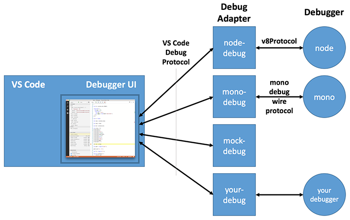

<p class="description"></p>


<br />

# 深入代码调试原理-QG VSCode篇
*slim*

> <font size=5>**前言**</font>
> Debugger按端大致分为vscode插件端和Server端，插件端主要负责，打开被调试工程，Socket连接Server通信，显示来自Server端的调试数据。Server端主要负责，监听端口等待vscode端连接，并在断点断住的时候传输调试数据给vscode端。

## 1 Debugger的整体架构
### 1.1 基本结构

vscode将整个调试器分为3个角色，**Debugger UI**、**DebugAdapter**、**Debugger**。
-   **Debugger**
    真正的调试器，掌管程序的状态和控制着程序的执行：**在断点处断住程序**，**获取变量的值**，**获取当前栈帧**，对于调试不同的语言，有不同的实现。比如在JAVA中，该角色就是JAVA虚拟机。在JavaScriptCore中，就是`JSC::Debugger`。

-   **Vscode Debugger UI**
    vscode提供给开发者的调试界面，用户可以通过UI操作：点击continue、step、查看变量的值，发送命令给DebugAdapter。
    

-   **DebugAdapter**
    开发者编写的插件，分别和UI、Debugger通信：
    -   接收来自UI的请求，来通知Debugger改变当前程序状态，如：UI收到点击Continue按钮事件后，通知DebugAdapter，后者会和Debugger进行通信，让程序继续跑。
    -   接收来自Debugger的状态变化，取出数据并更新UI，如：断点停下，Debugger主动通知DebugAdapter并带上栈帧数据，DebugAdapter接收到通知后将栈帧数据送给Debugger UI 去显示。
  

### 1.2 通信协议
#### 1.2.1 DebugAdapter和Debugger的通信协议
DebugAdapter和Debugger的通信协议是和Java调试协议（JDWP）类似，所有命令前4个字节为数据长度，紧跟着为具体数据，而数据的格式是JSON。命令体没有JDWP那样复杂。

比如设置断点协议：
```json
{
  "id": 1,
  "domain": "Debugger",
  "commands": {
    "name": "SetBreakpointByUrl",
    "parameters": [{
      "proj_dir":"blabla-game",
      "lineNumber": 73,
      "url": "BoxRotate.js"
    }]
  }
}
```
[Java调试协议JDWP详解](https://www.ibm.com/developerworks/cn/java/j-lo-jpda3/index.html)

#### 1.2.2 DebugAdapter和vscode UI的通信协议
与vscode ui的通信由vscode规范化的通信协议`DebugProtocol`定义，里面主要定义了三种数据类型，`ProtocolMessage`，`Arguments`，`Model`。
**ProtocolMessage**：定义了一套请求-回包(Request - Response)体系：
    1. Debugger UI 需要什么数据，就会dispatch具体的Request给DebugAdapter，带上参数（Arguments）。
    2. DebugAdapter收到Request，就将数据放入对应Response的body，回复给UI。
    3. 如果Adapter需要通知UI状态改变，通过发送Event实现。
**Arguments**：参数类型，不同Request需要不同的Arguments，统一以XXXArguments命名。
**Model**：这里的Model其实是vscode对于数据类型的封装，并不是一个统一接口。
比如栈帧：`StackFrame`，断点：`BreakPoint`，变量：`Variable`


## 2 事件序列
调试过程中的各种事件通过各种Request - Response - Event进行传递，最开始的调试命令是由用户点击绿色箭头开始的。


### 2.1 初始化（Initialization）
在初始化阶段，Adapter从收到`initializeRequest`开始，到`send LaunchReponse`结束，Adapter和Debugger主要做以下事情。
-   **自定义初始化参数**
    在`initializeRequest`中，自定义`InitializeResponse`中参数实现定制化，比如：**是否允许setVariable**、**是否允许条件断点**等。
-   **加载根目录配置文件 or 使用默认配置**
    `LaunchRequestArguments`会将调试工程在PC上的路径带过来，而我们则开始在根目录查找是否有配置文件，配置文件可以让开发者配置**qg.js的路径**和**入口js文件路径**，如果没有配置文件，则默认去工程根目录找**qg.js**，默认的入口文件为**index.js**。
-   **建立Socket连接及ADB端口转发**
    -   寻找合适的已连接的设备
        通过ADB server提供的服务：`host:devices`获取已连接设备列表，选出合适设备。
        ADB server的服务请看：https://android.googlesource.com/platform/system/core/+/jb-dev/adb/SERVICES.TXT
    -   端口转发（ADB Forward）
        因为真正调试的Debugger，也就是JSC::Debugger运行在手机端并Listen了手机端端口A，而DebugAdapter运行在PC端连接上了端口B，如果要进行通信，必须进行端口转发将二者相连。而调用端口转发的方式同样是调用ADB server的服务`<host-prefix>:forward:<local>;<remote>`
    -   Socket连接
        通过上一步的端口转发，Adapter就可以启动Socket连接到指定手机端口了，socket连接上后会进行握手，握手成功后Socket连接成功。
    -   部署JS & run JS
        由于需要保证插件和Debugger使用同一份代码，需要将JS工程push到手机SD卡约定的目录下，此处使用命令`adb push <localDir> <remoteDir>`。并通过协议告诉Debugger

### 2.2 运行（Running）
在启动成功后，JS工程成功运行，如果有加断点，则会发起`SetBreakPointsRequest`，该方法的`args.breakpoints`会带上有断点文件的所有断点信息，例如断点的所在文件的文件名、绝对路径、行数。（如果有多个文件则调用多次，每次调用携带的是一个文件的断点信息），Adapter需要将这些文件名和行号等信息，一一告诉给Debugger就好了。

### 2.3 程序被断住（Breaking）
Debugger在拿到全部的断点信息后会缓存起来，当JavaScirptCore运行到断点处时，会断住程序并通知Debugger，Debugger则会将当前的栈帧序列给到Adapter。Adapter则会发送`StoppedEvent`告诉UI改变状态。UI接着会向Adapter请求需要的信息
-   **请求栈帧信息（StackFrames）**
    Debugger在将栈帧信息返回的时候已经包含了栈帧列表，js代码中进入一个方法则该方法压栈，出一个方法则该方法出栈，所以栈帧列表中包含的就是经过的所有方法。Adapter将拿到的栈帧信息编号序号后，返回以`DebugProtocol`定义的`StackFrame`结构体数组。
    
-   **请求变量范围（Scopes）**
    VscodeUI 拿到栈帧信息后，需要确认每个栈帧的变量有多少范围，如上图所说，通常每个栈帧的变量分为Local和Global，vscode会将这些不同种类的变量分开显示。
     
-   **请求变量的值（Variable）**
    当鼠标点击展开某个变量时，vscode会将这个变量的id通过`variablesRequestArgument`带下来，Adapter会向Debugger请求该变量的信息。vscode将变量分为**可展开** 和 **不可展开**的，可展开的变量说明是一个Object，不可展开的变量说明只是一个基本数据类型。Adapter拿到变量的值后将其以`DebugProtocol`定义的`Variable`形式返回。

### 2.4 调试阶段（Debugging）
程序一旦被断下来，UI更新后，vscode就进入了调试模式，vscode提供了很多入口供开发者操作，开发者通过鼠标点击来触发对应的Request。


### 2.5 断开调试（Disconnect）
开发者点击stop按钮断开调试，与初始化模式相反，该阶段需要告诉Debugger调试程序已经退出、断开ADB和Socket等操作。